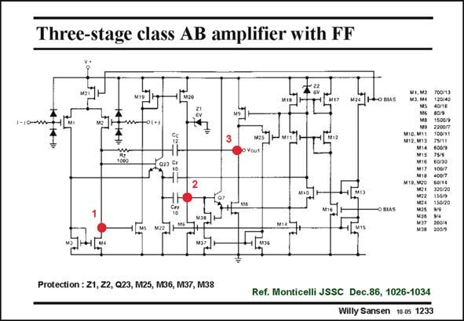

# SANSEN-1233 · Three-stage class AB amplifier with FF

章节：12 AB 类放大器与驱动放大器  
PDF 页：346；书本页：353；幻灯片编号：1233  
状态：unreviewed



## 对应教材讲解

### PDF 346 · 书本 353

A three-stage class-AB amplifier is shown in this slide which uses feedforward to boost the high-frequency performance. The first stage is single-ended, which is not good for CMRR. The second stage is a non-inverting amplifier which uses a current mirror. The third stage consists again of pMOST and nMOST devices Drain to Drain. The nMOST is driven by an emitter follower to drive the large C capacitor. The GS8 pMOST is driven by a level shifter M10/M11, which is bootstrapped out for AC operation. The compensation is not a pure case of nested Miller compensation. Compensation capacitor C determines the GBW. The other capacitors provide feedforward. c The quiescent current in the output transistors is set by two translinear loops consisting of M9/M11 with M17/M12 for the pMOST output transistor M9, and of M8/M10 with M13/M15 for the nMOST. The total current consumption (on 5 V) is 0.35 mA. About 22 mA can be delivered to a lowresistance load.

## 公式／性能结论候选摘录

以下为规则截取的原文，尚未逐项判读。

（未由规则找到；不代表原页没有此类内容。）

## 曲线结论候选摘录

以下为规则截取的原文，尚未逐项判读。

（未由规则找到；不代表原页没有此类内容。）

## 原文条件与近似候选摘录

以下为规则截取的原文，尚未逐项判读。

（未由规则找到；不代表原页没有此类内容。）

## 幻灯片 OCR（未校正）

```text
Three-stage class AB amplifier with FF
мз. м4
*2||
÷
M1D. M11
M12. M13
M16
120/40
40/16
80/9
100/11
75/11
60/30
-O BIAS
M22
M?4
150/20
Protection : 21, Z2, Q23, M25, M36, M37, M38
Ref. Monticelli JSSC Dec.86, 1026-1034
Willy Sansen 10.05 1233
```

数学上下标、分数及正负号以原图为准。电路图已保留；未核对的连接不输出成可仿真 netlist。
