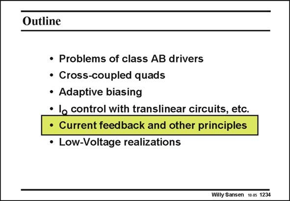

# SANSEN-1234 · Slide 1234

章节：12 AB 类放大器与驱动放大器  
PDF 页：347；书本页：354；幻灯片编号：1234  
状态：unreviewed



## 对应教材讲解

### PDF 347 · 书本 354

Translinear circuits for the definition of the quiescent currents in the output transistors have the disadvantage that the maximum output current is limited. Several more other principles are therefore investigated. The first one is the application of current feedback to obtain an expanding characteristic.

## 公式／性能结论候选摘录

以下为规则截取的原文，尚未逐项判读。

- PDF 347: Translinear circuits for the definition of the quiescent currents in the output transistors have the disadvantage that the maximum output current is limited.
- PDF 347: Several more other principles are therefore investigated.

## 曲线结论候选摘录

以下为规则截取的原文，尚未逐项判读。

- PDF 347: The first one is the application of current feedback to obtain an expanding characteristic.

## 原文条件与近似候选摘录

以下为规则截取的原文，尚未逐项判读。

（未由规则找到；不代表原页没有此类内容。）

## 幻灯片 OCR（未校正）

```text
Outline
• Problems of class AB drivers
• Cross-coupled quads
• Adaptive biasing
• lo control with translinear circuits, etc.
• Current feedback and other principles
• Low-Voltage realizations
Willy Sansen 1005 1234
```

数学上下标、分数及正负号以原图为准。电路图已保留；未核对的连接不输出成可仿真 netlist。
