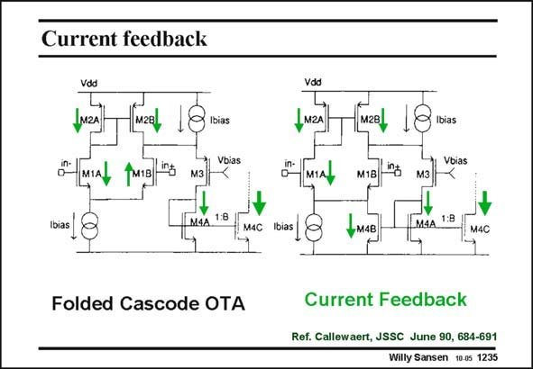

# SANSEN-1235 · Current feedback

章节：12 AB 类放大器与驱动放大器  
PDF 页：347；书本页：354；幻灯片编号：1235  
状态：unreviewed



## 对应教材讲解

### PDF 347 · 书本 354

A simple but very currentefficient realization is shown in this slide. On the left is a conventional differential pair loaded with a folded cascode. Its output current is simply B times the circular current of the differential pair. The currents are indicated by arrows. This output current is limited to the B times I bias however as every differential pair has a limiting characteristic. The addition of just one single transistor changes the operation drastically and converts this stage into a class-AB amplifier. Transistor M4B is added, which forms a current mirror with M4A as well. It provides current feedback to the differential pair. Two equal currents now flow from supply to supply. The first one flows through transistors M2A, M1A and M4B. The other one flows through M2B, M3 and M4A, and is multiplied with B towards the output. These currents are not limited by the biasing current I . They can be bias much larger depending on the transistor sizes. They have an expanding or class-AB characteristic. Clearly, these currents can only increase. Another stage with pMOSTs at the input is now required to have expanding currents in both directions. This is shown next.

## 公式／性能结论候选摘录

以下为规则截取的原文，尚未逐项判读。

- PDF 347: This output current is limited to the B times I bias however as every differential pair has a limiting characteristic.
- PDF 347: Two equal currents now flow from supply to supply.
- PDF 347: These currents are not limited by the biasing current I .
- PDF 347: They can be bias much larger depending on the transistor sizes.
- PDF 347: Clearly, these currents can only increase.

## 曲线结论候选摘录

以下为规则截取的原文，尚未逐项判读。

- PDF 347: This output current is limited to the B times I bias however as every differential pair has a limiting characteristic.
- PDF 347: They have an expanding or class-AB characteristic.

## 原文条件与近似候选摘录

以下为规则截取的原文，尚未逐项判读。

- PDF 347: They can be bias much larger depending on the transistor sizes.

## 幻灯片 OCR（未校正）

```text
Current feedback
Vdd
IM2A
M2B
Vbias
TM1B
1:8
bias
Folded Cascode OTA
M2A
[м2вl 18
Ibias
Vbias
M3
M4A
1:8
M4C
Current Feedback
Ref. Callewaert, JSSC June 90, 684-691
Willy Sansen 10.05 1235
```

数学上下标、分数及正负号以原图为准。电路图已保留；未核对的连接不输出成可仿真 netlist。
