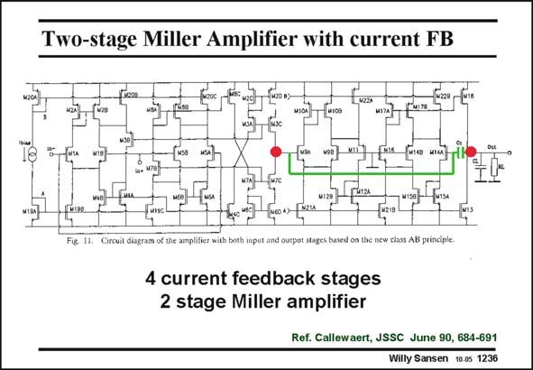

# SANSEN-1236 · Two-stage Miller Amplifier with current FB

章节：12 AB 类放大器与驱动放大器  
PDF 页：348；书本页：355；幻灯片编号：1236  
状态：unreviewed



## 对应教材讲解

### PDF 348 · 书本 355

The first nMOST input current-feedback stage is put in parallel with a pMOST one. Their outputs are current mirrored to a high impedance output node, labeled with a big (red) dot. A second similar nMOST/ pMOST current-feedback stage is then used as an output stage. This is thus a two-stage amplifier. The Miller compensation capacitance is clearly seen. The parallel nMOST/ pMOST pair at the input provide nearly rail-to-rail input capability. Indeed, for low input common-mode voltages the nMOSTs shut off but the pMOSTs take over and vice versa. The rail itself cannot actually be reached because of a diode-connected transistor M2a (in the first stage). About 0.1 V is lost at both supply lines. No g −equalization is provided. m For a 10 kV/100 pF load, the GBW is 0.37 MHz and power dissipation 0.25 mW (for ±5 V supply voltages).

## 公式／性能结论候选摘录

以下为规则截取的原文，尚未逐项判读。

- PDF 348: This is thus a two-stage amplifier.
- PDF 348: No g −equalization is provided. m For a 10 kV/100 pF load, the GBW is 0.37 MHz and power dissipation 0.25 mW (for ±5 V supply voltages).

## 曲线结论候选摘录

以下为规则截取的原文，尚未逐项判读。

（未由规则找到；不代表原页没有此类内容。）

## 原文条件与近似候选摘录

以下为规则截取的原文，尚未逐项判读。

- PDF 348: No g −equalization is provided. m For a 10 kV/100 pF load, the GBW is 0.37 MHz and power dissipation 0.25 mW (for ±5 V supply voltages).

## 幻灯片 OCR（未校正）

```text
Two-stage Miller Amplifier with current FB
Fuтes unc
Circuit diagram of the amplifier with be
ouipol starcs bascu on tac ncw ciass no pruicipie.
4 current feedback stages
2 stage Miller amplifier
Ref. Callewaert, JSSC June 90, 684-691
Willy Sansen 10.05 1236
```

数学上下标、分数及正负号以原图为准。电路图已保留；未核对的连接不输出成可仿真 netlist。
