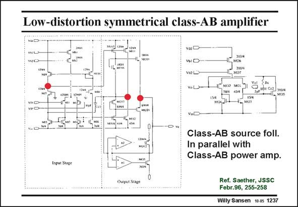

# SANSEN-1237 · Low-distortion symmetrical class-AB amplifier

章节：12 AB 类放大器与驱动放大器  
PDF 页：348；书本页：355；幻灯片编号：1237  
状态：unreviewed



## 对应教材讲解

### PDF 348 · 书本 355

This amplifier has two output stages in parallel. The top one uses source followers. It can provide moderate voltage swing but with very low distortion. However, most of the gain and current (power) comes from the bottom amplifier. It consists of two error amplifiers followed by two output transistors, Drain to Drain. Some offset is built in the error amplifiers (shown on the right) so that the output devices are turned off for small output signals. In this way they do not generate cross-over distortion. The source follower amplifier carries out all the tasks. For large output swing, the source follower amplifier cannot follow any more. The class-AB power amplifier can still provide rail-to-rail output swing, even when the output devices end up in the linear region. The error amplifier still provides sufficient gain.

### PDF 349 · 书本 356

The quiescent current in the low-distortion source-follower amplifier is set by the translinear loop of transistors MO16/MO19 and MO17/MO20. The DC current through MO17/17 sets the current in the output devices MO19/20. For a 1 kV/150 pF load, the Slew Rate is 7 V/ms. The GBW is 5.5 MHz and power dissipation 6.5 mW (±5 V). The equivalent input noise is 10 nV /√Hz, which is quite low. RMS

## 公式／性能结论候选摘录

以下为规则截取的原文，尚未逐项判读。

- PDF 348: However, most of the gain and current (power) comes from the bottom amplifier.
- PDF 348: The error amplifier still provides sufficient gain.

## 曲线结论候选摘录

以下为规则截取的原文，尚未逐项判读。

（未由规则找到；不代表原页没有此类内容。）

## 原文条件与近似候选摘录

以下为规则截取的原文，尚未逐项判读。

（未由规则找到；不代表原页没有此类内容。）

## 幻灯片 OCR（未校正）

```text
Low-distortion symmetrical class-AB amplifier
I2w4
200/4
MO%
200/4
Va LX
HI. MUs
MISTH
Class-AB source foll.
In parallel with
Class-AB power amp.
Inpur Suge
Ref. Saether, JSSC
Febr.96, 255-258
Willy Sansen 10.05 1237
```

数学上下标、分数及正负号以原图为准。电路图已保留；未核对的连接不输出成可仿真 netlist。
