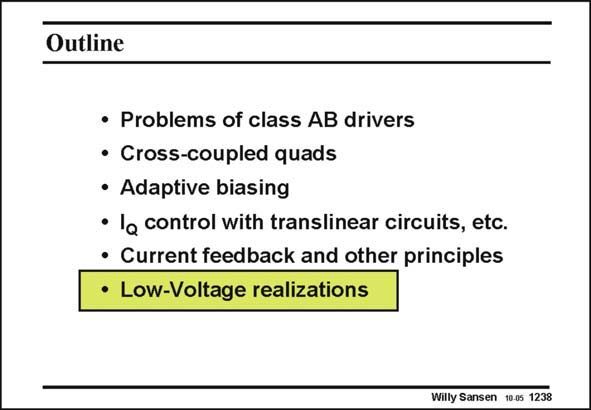

# SANSEN-1238 · Slide 1238

章节：12 AB 类放大器与驱动放大器  
PDF 页：349；书本页：356；幻灯片编号：1238  
状态：unreviewed



## 对应教材讲解

### PDF 349 · 书本 356

More recent technologies use smaller channel lengths. As a consequence, the supply voltage has become smaller as well. There is a need for class-AB stages for supply voltages of 1.5 V and less. Translinear circuits cannot be used any more. Several examples are given next.

## 公式／性能结论候选摘录

以下为规则截取的原文，尚未逐项判读。

（未由规则找到；不代表原页没有此类内容。）

## 曲线结论候选摘录

以下为规则截取的原文，尚未逐项判读。

（未由规则找到；不代表原页没有此类内容。）

## 原文条件与近似候选摘录

以下为规则截取的原文，尚未逐项判读。

（未由规则找到；不代表原页没有此类内容。）

## 幻灯片 OCR（未校正）

```text
Outline
• Problems of class AB drivers
• Cross-coupled quads
• Adaptive biasing
• la control with translinear circuits, etc.
• Current feedback and other principles
• Low-Voltage realizations
Willy Sansen 100s 1238
```

数学上下标、分数及正负号以原图为准。电路图已保留；未核对的连接不输出成可仿真 netlist。
