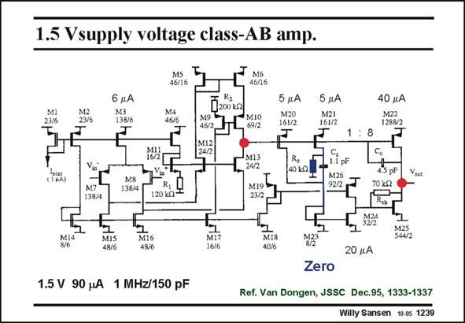

# SANSEN-1239 · 1.5 Vsupply voltage class-AB amp.

章节：12 AB 类放大器与驱动放大器  
PDF 页：349；书本页：356；幻灯片编号：1239  
状态：unreviewed



## 对应教材讲解

### PDF 349 · 书本 356

At low supply voltages, the circuitry becomes simpler. In this 1.5 V amplifier, the input stage is a folded cascode. It is followed by an output stage in which the output pMOST is connected directly to the output of the input stage. The output nMOST drive is very different however. It leads to a current mirror M23/M24 to carry out two inversions. Remember that output transistors have to be driven in phase. This gives rise to extra poles, which have to be compensated for. Two tricks are used. The first one is local feedback around output transistor M25, with resistor R . This shunt-shunt feedback lowers the impedance at input and output indeed. sh The second trick is the introduction of a zero with time constant R C . This must be tuned z z to one of the non-dominant poles, which is not that easy of course.

### PDF 350 · 书本 357

The quiescent current in the output devices is not that well defined. The variation of this current is decreased by the local feedback of resistor R . However, it will never be really sh independent of the supply or output voltage.

## 公式／性能结论候选摘录

以下为规则截取的原文，尚未逐项判读。

- PDF 350: The variation of this current is decreased by the local feedback of resistor R .
- PDF 350: However, it will never be really sh independent of the supply or output voltage.

## 曲线结论候选摘录

以下为规则截取的原文，尚未逐项判读。

- PDF 349: Remember that output transistors have to be driven in phase.

## 原文条件与近似候选摘录

以下为规则截取的原文，尚未逐项判读。

（未由规则找到；不代表原页没有此类内容。）

## 幻灯片 OCR（未校正）

```text
1.5 Vsupply voltage class-AB amp.
M1I
M2
23/6
6 нА
M3
138/6
46/16
M4
46/6
(LNA)
MIO
69/2
M13
24/2
M19
23/2
5 дА
M20
161/2
40 kQ|
5 дА
M21
161/2
1
ilpF
M26
40 нА
M22
1288/2
8
M8
138/4
70 kN
M7
138/4
120 kg
MIS
48/6
M16
M17
16/6
MIS
4016
S44/2
20 мА
1.5 V 90 MA 1 MHz/150 pF
Zero
Ref. Van Dongen, JSSC Dec.95, 1333-1337
Willy Sansen 10.05 1239
```

数学上下标、分数及正负号以原图为准。电路图已保留；未核对的连接不输出成可仿真 netlist。
