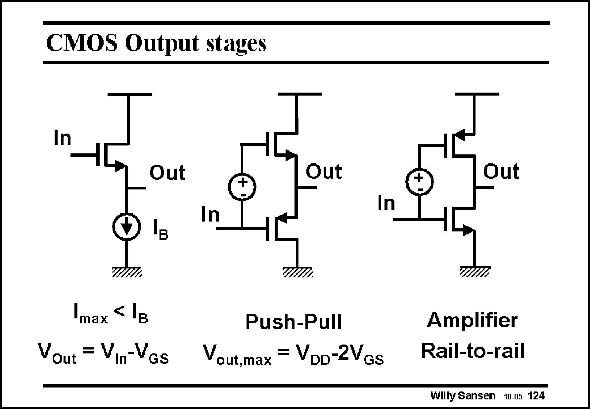

# SANSEN-124 · CMOS Output stages

章节：12 AB 类放大器与驱动放大器  
PDF 页：331；书本页：338；幻灯片编号：124  
状态：unreviewed



## 对应教材讲解

### PDF 331 · 书本 338

A possible solution is to have two source followers, Source to Source, as shown in the middle. The current out of this stage (source) can again be very large, depending on the transistor size. The current in this stage (sink) can also be large. The pMOST can now be driven as hard as the nMOST. The main disadvantage of this double source follower is that the output swing can only reach the supply voltage within one V . Also, GSn the output voltage can never be lower than V . For large supply voltages, such as audio GSp amplifiers, this is no problem but for supply voltages of a few Volts, this is not acceptable. This is why most class-AB output stages for low supply voltages have two output transistors Drain-to-Drain. They constitute an amplifier with al least two stages. Stability will have to be verified. They do guarantee rail-to-rail output swing however, at least for capacitive loads. In this case, the low output resistance will have to be realized by application of feedback, aggravating the stability issue even more.

## 公式／性能结论候选摘录

以下为规则截取的原文，尚未逐项判读。

- PDF 331: The current out of this stage (source) can again be very large, depending on the transistor size.

## 曲线结论候选摘录

以下为规则截取的原文，尚未逐项判读。

（未由规则找到；不代表原页没有此类内容。）

## 原文条件与近似候选摘录

以下为规则截取的原文，尚未逐项判读。

（未由规则找到；不代表原页没有此类内容。）

## 幻灯片 OCR（未校正）

```text
CMOS Output stages
In
Out
Out
Push-Pull
Vout,max = VDD-2VGs
Out
In
In
TÀTA
max
Vout = VIn-VGs
THII,
Amplifier
Rail-to-rail
Willy Sansen .m 124
```

数学上下标、分数及正负号以原图为准。电路图已保留；未核对的连接不输出成可仿真 netlist。
