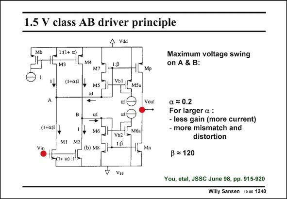

# SANSEN-1240 · 1.5 V class AB driver principle

章节：12 AB 类放大器与驱动放大器  
PDF 页：350；书本页：357；幻灯片编号：1240  
状态：unreviewed



## 对应教材讲解

### PDF 350 · 书本 357

A simpler low-voltage class- AB amplifier is shown in this slide. Only the output stage is shown. It consists of two current mirrors with current factor b. They are driven by two parallel input devices, with different sizes however. Indeed transistor M1 is (1+a) times larger than transistor M2. The top current mirror with pMOSTs is biased by aI and so is the bottom one with nMOSTs. These are the quiescent currents and are well defined. The main advantage of this driver is that points A and B can have very large swings. The output stage can sink and source currents which are much larger than the quiescent currents. For a large voltage, on point B for example, V becomes very large but V is limited by the GS8 DS8 cascode M6. Transistor M8 enters the linear region. This levels off somewhat the increase in output current. This current is still a lot larger than for a translinear loop.

## 公式／性能结论候选摘录

以下为规则截取的原文，尚未逐项判读。

- PDF 350: For a large voltage, on point B for example, V becomes very large but V is limited by the GS8 DS8 cascode M6.
- PDF 350: This levels off somewhat the increase in output current.

## 曲线结论候选摘录

以下为规则截取的原文，尚未逐项判读。

（未由规则找到；不代表原页没有此类内容。）

## 原文条件与近似候选摘录

以下为规则截取的原文，尚未逐项判读。

- PDF 350: The output stage can sink and source currents which are much larger than the quiescent currents.

## 幻灯片 OCR（未校正）

```text
1.5 V class AB driver principle
4 vos
1:(1+ a)
M4
Maximum voltage swing
on A & B:
(1+a)I
A
(I+a)l V
Vin
M7
MS
al
al
→*
M6
(b) M8
Mp
VOLEMSA
Vou:
Mбa
MI M2|
x1+a):1
Vb2
1:B
Mn
a = 0.2
For larger a :
- less gain (more current)
- more mismatch and
distortion
B = 120
Vss
You, etal, JSSC June 98, pp. 915-920
Willy Sansen 1005 1240
```

数学上下标、分数及正负号以原图为准。电路图已保留；未核对的连接不输出成可仿真 netlist。
