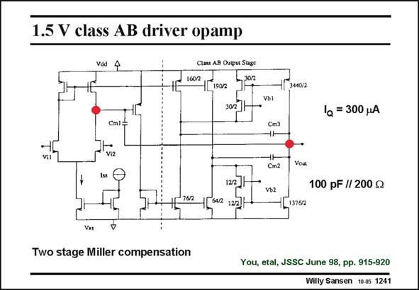

# SANSEN-1241 · 1.5 V class AB driver opamp

章节：12 AB 类放大器与驱动放大器  
PDF 页：350；书本页：357；幻灯片编号：1241  
状态：unreviewed



## 对应教材讲解

### PDF 350 · 书本 357

The full amplifier is shown in this slide. The first stage is a simple differential pair followed by a current mirror to drive the output stage. Only two high-impedance points can be distinguished. Capacitor C sets the m1 GBW, together with g . m1 Capacitors C and C see m2 m3 small resistances only, and are not so effective.

## 公式／性能结论候选摘录

以下为规则截取的原文，尚未逐项判读。

（未由规则找到；不代表原页没有此类内容。）

## 曲线结论候选摘录

以下为规则截取的原文，尚未逐项判读。

（未由规则找到；不代表原页没有此类内容。）

## 原文条件与近似候选摘录

以下为规则截取的原文，尚未逐项判读。

（未由规则找到；不代表原页没有此类内容。）

## 幻灯片 OCR（未校正）

```text
1.5 V class AB driver opamp
Vad
4
Clats AB Oatpur Stage
I602
IC
19072
302
3440/2
1 = 300 MA
Cmi=
Cm3
viz
tss
Cm2
Vb2
Yout
100 pF // 200 g
76/2
13762
Vàs
Two stage Miller compensation
You, etal, JSSC June 98, pp. 915-920
Willy Sansen 1005 1241
```

数学上下标、分数及正负号以原图为准。电路图已保留；未核对的连接不输出成可仿真 netlist。
