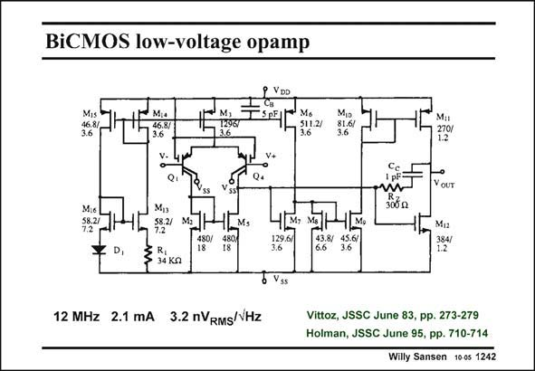

# SANSEN-1242 · BiCMOS low-voltage opamp

章节：12 AB 类放大器与驱动放大器  
PDF 页：351；书本页：358；幻灯片编号：1242  
状态：unreviewed



## 对应教材讲解

### PDF 351 · 书本 358

A somewhat similar principle for the quiescent current is used in this amplifier. It is a two-stage amplifier which can operate at low supply voltages. The input devices are lateral pnp transistors. Actually they are pMOSTs in which the Source-Bulk diode is forward biased (ref. Vittoz). They exhibit very low 1/f noise. Output transistor M12 is driven directly by the first stage. The other output transistor M11 is driven by two inverters M7-M9 and M10-M11. The quiescent current in the output transistors is controlled by current source M6. Indeed its currents is split up in two parts. The first part flows through M7, which has the same V as GS output transistor M12, and which has a fixed ratio in current to M12. The other part flows through M8, which controls the current in output transistor M11 by means of two current mirrors. The currents in the output transistors must be the same. The current through M6 controls this current. Using the sizes of the transistors in this slide, the quiescent current is about 1.6 times larger than the current in transistor M6.

## 公式／性能结论候选摘录

以下为规则截取的原文，尚未逐项判读。

（未由规则找到；不代表原页没有此类内容。）

## 曲线结论候选摘录

以下为规则截取的原文，尚未逐项判读。

（未由规则找到；不代表原页没有此类内容。）

## 原文条件与近似候选摘录

以下为规则截取的原文，尚未逐项判读。

（未由规则找到；不代表原页没有此类内容。）

## 幻灯片 OCR（未校正）

```text
BiCMOS low-voltage opamp
M,
296
46.8/
3.6
Mo
3112
YOUT
Mis
58.21
M,s
$8.2/
7.2
R,
34 Kg
Mi2
12 MHz 2.1 mA 3.2 nVRMS/VHz
Vittoz, JSSC June 83, pp. 273-279
Holman, JSSC June 95, pp. 710-714
Willy Sansen 1005 1242
```

数学上下标、分数及正负号以原图为准。电路图已保留；未核对的连接不输出成可仿真 netlist。
