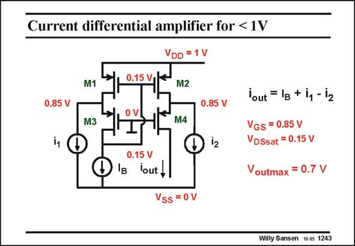

# SANSEN-1243 · Current differential amplifier for < 1V

章节：12 AB 类放大器与驱动放大器  
PDF 页：351；书本页：358；幻灯片编号：1243  
状态：unreviewed



## 对应教材讲解

### PDF 351 · 书本 358

A very different principle is based on the current differential amplifier, which has been discussed in Chapter 3. It has three current inputs, actually four, if an extra current input source is applied to the Drain of transistor M4. Moreover, it can operate on very low supply voltages. If a threshold voltage V T is taken of 0.7 V, and a V −V (and V ) of only GS T DSsat 0.15 V, then the supply voltage can be as low as 1 Volt. The maximum output voltage can then be as high as 0.7 V. If however the V is only 0.3 V, and the same V −V of 0.15 V is taken, then the supply T GS T voltage can be a mere 0.6 V!

### PDF 352 · 书本 359

A similar biasing will be used for the class-AB amplifier discussed next. It can therefore be used at a supply voltage of only 0.6 V!

## 公式／性能结论候选摘录

以下为规则截取的原文，尚未逐项判读。

- PDF 352: It can therefore be used at a supply voltage of only 0.6 V!

## 曲线结论候选摘录

以下为规则截取的原文，尚未逐项判读。

（未由规则找到；不代表原页没有此类内容。）

## 原文条件与近似候选摘录

以下为规则截取的原文，尚未逐项判读。

（未由规则找到；不代表原页没有此类内容。）

## 幻灯片 OCR（未校正）

```text
Current differential amplifier for < 1V
VDD = 1V
0.15 V
M1
M2
0.85 V
M3
oV
0.85 V
M4
0.15 V
IB lout,
lout = 1g + i, - i2
VGS = 0.85 V
VDSsat = 0.15 V
Voutmax = 0.7 V
Vss = 0V
Willy Sansen 10.05 1243
```

数学上下标、分数及正负号以原图为准。电路图已保留；未核对的连接不输出成可仿真 netlist。
