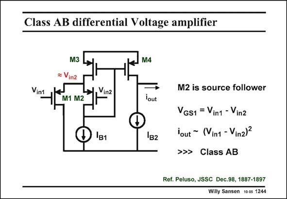

# SANSEN-1244 · Class AB differential Voltage amplifier

章节：12 AB 类放大器与驱动放大器  
PDF 页：352；书本页：359；幻灯片编号：1244  
状态：unreviewed



## 对应教材讲解

### PDF 352 · 书本 359

The class-AB amplifier is shown in this slide. On first sight it seems to consist of a differential pair, the output of which is fed back to the current mirror, biasing this pair. However, feedback from a differential output to a common-mode node is impossible to grasp. A better way to understand this circuit is to note that transistor M2 has a constant current, i.e. current I . If not, the feedback loop B1 to the Gate of M3 will make sure of that. The only basic single-transistor configuration in which the transistor carries only DC current is the Source follower. Transistor M2 acts as a Source Follower. It passes input voltage V unattenuated to the Source of the other input transistor M1. in2 Input transistor M1 is a differential amplifier by itself. One input voltage V is at its Gate in1 and the other, V at its Source. It converts this differential input voltage into an AC current in2 which flows from the supply through transistors M3 and M1 to ground. It is mirrored by the current mirror M3/M4 to the output. It could also be mirrored out at the Drain of M1 however, as will be done in the full circuit, shown next. This AC current is not limited by any DC current. Moreover, it has an expanding characteristic because of the square-law characteristic of a MOST. Transistor M1 acts as a class-AB amplifier.

## 公式／性能结论候选摘录

以下为规则截取的原文，尚未逐项判读。

- PDF 352: This AC current is not limited by any DC current.

## 曲线结论候选摘录

以下为规则截取的原文，尚未逐项判读。

- PDF 352: Moreover, it has an expanding characteristic because of the square-law characteristic of a MOST.

## 原文条件与近似候选摘录

以下为规则截取的原文，尚未逐项判读。

（未由规则找到；不代表原页没有此类内容。）

## 幻灯片 OCR（未校正）

```text
Class AB differential Voltage amplifier
Vint
M3
Vin2
M1 M2
M4
Vinz
lout
1в1
1B2
M2 is source follower
VGS1 = Vin1 - Vinz
lout ~ (Vint - Vin2)2
>>> Class AB
Ref. Peluso, JSSC Dec.98, 1887-1897
Willy Sansen 10 0s 1244
```

数学上下标、分数及正负号以原图为准。电路图已保留；未核对的连接不输出成可仿真 netlist。
