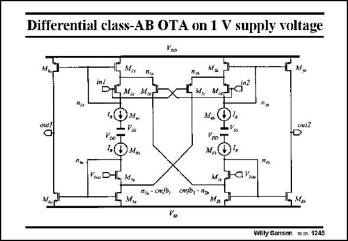

# SANSEN-1245 · Differential class-AB OTA on 1 V supply voltage

章节：12 AB 类放大器与驱动放大器  
PDF 页：352；书本页：359；幻灯片编号：1245  
状态：unreviewed



## 对应教材讲解

### PDF 352 · 书本 359

The full schematic is given in this slide. It is fully differential. The commonmode feedback CMFB is not shown. The class-AB voltage-tocurrent converting transistors are M1b and M1c. Transistor M1a passes input voltage in1 to the Source of M1b. An AC current is generated by transistor M1b. This current is mirrored to output out1 by current mirror M2a/M3a and to output out2 by current mirror M5b/M6b.

### PDF 353 · 书本 360

The same applies to the AC current generated by transistor M1c. It is mirrored to the outputs as well. The CMFB can be realized by application of a current to the sources of M7a/M7b.

## 公式／性能结论候选摘录

以下为规则截取的原文，尚未逐项判读。

（未由规则找到；不代表原页没有此类内容。）

## 曲线结论候选摘录

以下为规则截取的原文，尚未逐项判读。

（未由规则找到；不代表原页没有此类内容。）

## 原文条件与近似候选摘录

以下为规则截取的原文，尚未逐项判读。

（未由规则找到；不代表原页没有此类内容。）

## 幻灯片 OCR（未校正）

```text
Differential class-AB OTA on 1 V supply voltage
Vno
M.,
in!
PLM, MN
M. M,y
"Jo
out!
out2
Poc"
1(
DMe
Vrai H M
Vne T
",
nju - CrcJW,
M,,
cmjb, - n,
Mise rr
Wilty Sansen m.us 1245
```

数学上下标、分数及正负号以原图为准。电路图已保留；未核对的连接不输出成可仿真 netlist。
