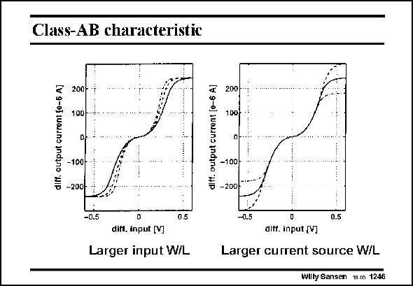

# SANSEN-1246 · Class-AB characteristic

章节：12 AB 类放大器与驱动放大器  
PDF 页：353；书本页：360；幻灯片编号：1246  
状态：unreviewed



## 对应教材讲解

### PDF 353 · 书本 360

The input transistors M1b and M1c determine the gain from input voltage to output current. Increasing their size increases their gain, as shown left. For a zero differential input voltage, the differential output current is zero as well. For small input voltages, an expanding characteristic is obtained. For very large input voltages, the maximum output current saturates, depending on the relative transistor ratios. The quiescent current is set by current sources I , which is about 2 mA. The current drive B capability is also quite high. An increase in the DC current sources I , evidently increases the maximum output current as B well. This is shown on the right.

## 公式／性能结论候选摘录

以下为规则截取的原文，尚未逐项判读。

- PDF 353: The input transistors M1b and M1c determine the gain from input voltage to output current.
- PDF 353: Increasing their size increases their gain, as shown left.
- PDF 353: For very large input voltages, the maximum output current saturates, depending on the relative transistor ratios.
- PDF 353: An increase in the DC current sources I , evidently increases the maximum output current as B well.

## 曲线结论候选摘录

以下为规则截取的原文，尚未逐项判读。

- PDF 353: For small input voltages, an expanding characteristic is obtained.

## 原文条件与近似候选摘录

以下为规则截取的原文，尚未逐项判读。

- PDF 353: For very large input voltages, the maximum output current saturates, depending on the relative transistor ratios.

## 幻灯片 OCR（未校正）

```text
Class-AB characteristic
diff. output current {e-5 AJ
200-
100-
-100
-200
diff. output current [e-6 A]
-0.5
0.5
difl, input [V]
Larger input W/L
200
100
-100-
-200|
-0.5
0.5
diff. input (V]
Larger current source W/L
Willy Sansen
111.03 1246
```

数学上下标、分数及正负号以原图为准。电路图已保留；未核对的连接不输出成可仿真 netlist。
