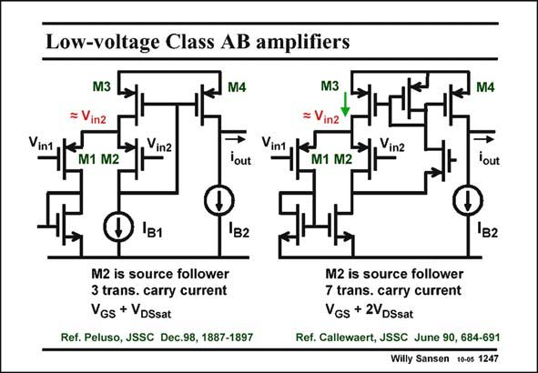

# SANSEN-1247 · Low-voltage Class AB amplifiers

章节：12 AB 类放大器与驱动放大器  
PDF 页：353；书本页：360；幻灯片编号：1247  
状态：unreviewed



## 对应教材讲解

### PDF 353 · 书本 360

This last class-AB amplifier is actually a simplified version of the class-AB amplifier using current feedback, discussed before. Both are sketched next to each other for sake of comparison. Both use transistor M2 as a Source follower. Both amplifiers use transistor M2 as a Source follower. In the last amplifier (on the left), only one single transistor provides the voltage-to-current conversion. Only three transistors carry AC current. This is clearly an advantage for high-frequency or for low-power design, or both. In the right amplifier, seven transistors carry an AC current. In principle the more transistors carry an AC current, the more poles are generated and the slower the circuit will be. The left amplifier is better with this respect.

### PDF 354 · 书本 361

Moreover, the left amplifier can work at a lower supply voltage. The minimum supply voltage of the right amplifier is V +2V but only V +V for the left one. For a V of only GS DSsat GS DSsat T 0.3 V, and a V −V of 0.2 V is taken, then the minimum supply voltage is 0.7 V for the left GS T amplifier but 0.9 V for the right one. The left amplifier is clearly superior.

## 公式／性能结论候选摘录

以下为规则截取的原文，尚未逐项判读。

（未由规则找到；不代表原页没有此类内容。）

## 曲线结论候选摘录

以下为规则截取的原文，尚未逐项判读。

（未由规则找到；不代表原页没有此类内容。）

## 原文条件与近似候选摘录

以下为规则截取的原文，尚未逐项判读。

（未由规则找到；不代表原页没有此类内容。）

## 幻灯片 OCR（未校正）

```text
Low-voltage Class AB amplifiers
M3
= Vin2
M1 M2
Vinz
M4
lout
M3
= Vin2
→, Vinz
M1 M2
M4
lout
1в1
1B2
M2 is source follower
3 trans. carry current
VGs + VDSsat
Ref. Peluso, JSSC Dec.98, 1887-1897
1B2
M2 is source follower
7 trans. carry current
VGs + 2VDSsat
Ref. Callewaert, JSSC June 90, 684-691
Willy Sansen 10-0s 1247
```

数学上下标、分数及正负号以原图为准。电路图已保留；未核对的连接不输出成可仿真 netlist。
