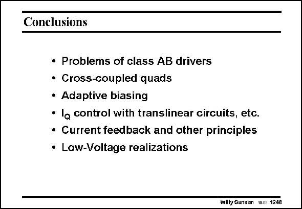

# SANSEN-1248 · Conclusions

章节：12 AB 类放大器与驱动放大器  
PDF 页：354；书本页：361；幻灯片编号：1248  
状态：unreviewed



## 对应教材讲解

### PDF 354 · 书本 361

A large variety of class-AB amplifiers have been discussed and compared. Many different principles are available depending on the required power levels and output loads. This is only a selection of the amplifiers published. It is a good overview though. For all amplifiers discussed, the full references are now listed. They allow the reader to study these amplifiers in more detail. More references are given than have been included in this chapter. This is done to give the reader a more complete list of references to amplifiers, which deserve to be examined.

## 公式／性能结论候选摘录

以下为规则截取的原文，尚未逐项判读。

- PDF 354: Many different principles are available depending on the required power levels and output loads.

## 曲线结论候选摘录

以下为规则截取的原文，尚未逐项判读。

（未由规则找到；不代表原页没有此类内容。）

## 原文条件与近似候选摘录

以下为规则截取的原文，尚未逐项判读。

（未由规则找到；不代表原页没有此类内容。）

## 幻灯片 OCR（未校正）

```text
Conclusions
• Problems of class AB drivers
• Cross-coupled quads
• Adaptive biasing
• lo control with translinear circuits, etc.
• Current feedback and other principles
• Low-Voltage realizations
Wilty Sansen w.ns 1248
```

数学上下标、分数及正负号以原图为准。电路图已保留；未核对的连接不输出成可仿真 netlist。
