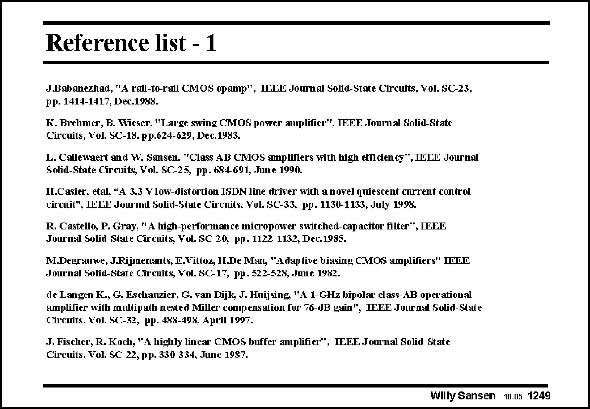

# SANSEN-1249 · Reference list - 1

章节：12 AB 类放大器与驱动放大器  
PDF 页：354；书本页：361；幻灯片编号：1249  
状态：unreviewed



## 对应教材讲解

本页为参考文献幻灯片；已查看原 PDF，原页没有另外的正文讲解。

## 公式／性能结论候选摘录

以下为规则截取的原文，尚未逐项判读。

（未由规则找到；不代表原页没有此类内容。）

## 曲线结论候选摘录

以下为规则截取的原文，尚未逐项判读。

（未由规则找到；不代表原页没有此类内容。）

## 原文条件与近似候选摘录

以下为规则截取的原文，尚未逐项判读。

（未由规则找到；不代表原页没有此类内容。）

## 幻灯片 OCR（未校正）

```text
Reference list - 1
JBahanezhad, "A rat-to-ral CMOS opamp", uEtl: Journal Solld-Stare Ctrcults. Vol. SC-23.
pp. 1414-1417, Dec.1958.
K. Birhmer, B. Wicser, "Targr swing CMOS power auplificr", TEF.F. Iournal Solid.Statc
Circuits, Vol. SC-18. pp.624-629, Dec.1993.
L. Callewaert and W. Sansen. "Class AB CMOS amptlllers with high ethdency", IEEE Journat
Solid-State Circuito, Vol. SC-25, pp. 694691, June 1990.
Il.Casier. etal. "A. 3.3 V low-distorcon ISDN line driver witt a novel quiescent earrent control
circaul*. LeLE: Jow'ind Solid-State Circnits. Vol. SC-33. pp. 1130-1133, July 1995.
SCasat Cueca ush Vofsca, wwice ter neched spactor nter; Inir.
M.Deuranve, J.Ripaerunts, E.Vil(oz, II.De Mau, "a daptive bisxing CMOS waplifiers" ITE
Journal Solid-State Careults, Vol. SC-17, pu. 522-528, Jmuc 1982.
de Langen K., G. Eschanzier, G, van Dijk, J. Huijsing "A 1 GHz bipolae class AB opcratioual
iaplifier with raudiputh nested Miller compeas alion for 76-0B qain", IEEE Jotrnal Solid Stiúe
CTrCHiTs. Nol. SC:-72, PP. 4NX-40X. AprHl 199T.
J. Fischer, R. Kach, "A highly lincar CMOS buffer amplifier", IE.F.E.Journal Solid State
Circuits. Tol. SC 22, pp. 330 354, June 1987.
Wilty Sansen m.n5 1249
```

数学上下标、分数及正负号以原图为准。电路图已保留；未核对的连接不输出成可仿真 netlist。
