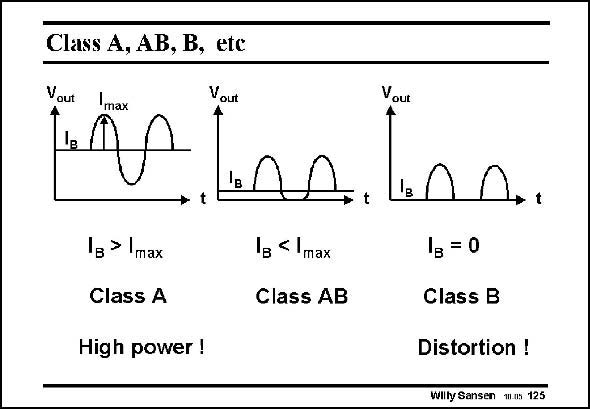

# SANSEN-125 · Class A, AB, B, ete

章节：12 AB 类放大器与驱动放大器  
PDF 页：332；书本页：339；幻灯片编号：125  
状态：unreviewed



## 对应教材讲解

### PDF 332 · 书本 339

Why do these amplifiers require class AB operation? The answer is that this is the best compromise between current capability and distortion. A class-A stage is a stage in which the peak current swing never exceeds the DC biasing current. The average current is therefore the DC current. In a class-B stage the DC biasing current is zero. Connecting these swings to the negative swings from another amplifier leads to discontinuities, which is called crossover distortion. Class-AB amplifiers are somewhere in between. The DC biasing current (or quiescent current) is small compared to the peak current swings. In this way the connections between the two halves are more smooth. The crossover distortion can be made very small indeed. One of the specifications will have to do with the predictability and stability of this quiescent current.

## 公式／性能结论候选摘录

以下为规则截取的原文，尚未逐项判读。

- PDF 332: The average current is therefore the DC current.

## 曲线结论候选摘录

以下为规则截取的原文，尚未逐项判读。

- PDF 332: A class-A stage is a stage in which the peak current swing never exceeds the DC biasing current.
- PDF 332: The DC biasing current (or quiescent current) is small compared to the peak current swings.

## 原文条件与近似候选摘录

以下为规则截取的原文，尚未逐项判读。

（未由规则找到；不代表原页没有此类内容。）

## 幻灯片 OCR（未校正）

```text
Class A, AB, B, ete
Vout
Vout
Vout
Vlnn.l
1в > max
lg < Imax
Class A
Class AB
High power !
1в = 0
Class B
Distortion !
Wilty Sansen M.ns 125
```

数学上下标、分数及正负号以原图为准。电路图已保留；未核对的连接不输出成可仿真 netlist。
