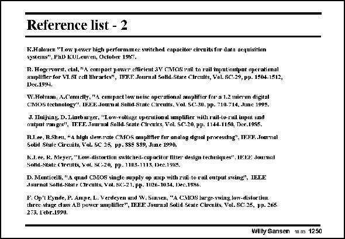

# SANSEN-1250 · Reference list - 2

章节：12 AB 类放大器与驱动放大器  
PDF 页：355；书本页：362；幻灯片编号：1250  
状态：unreviewed



## 对应教材讲解

本页为参考文献幻灯片；已查看原 PDF，原页没有另外的正文讲解。

## 公式／性能结论候选摘录

以下为规则截取的原文，尚未逐项判读。

（未由规则找到；不代表原页没有此类内容。）

## 曲线结论候选摘录

以下为规则截取的原文，尚未逐项判读。

（未由规则找到；不代表原页没有此类内容。）

## 原文条件与近似候选摘录

以下为规则截取的原文，尚未逐项判读。

（未由规则找到；不代表原页没有此类内容。）

## 幻灯片 OCR（未校正）

```text
Reference list - 2
K.Halouen "T.ow pover high performmee ssitched capacitor circnits for data acquisition
systeras", PhD KULenven, October 1957.
W.Holman, A.Comcily, "A eoipact low noise operational amplitier for a 1.2 minm digtal
CMOS technolocy", IE.E.E. Jounal 8olld.State Cireuits, Vol. SC-30. pp. 710-714, June 1995.
J. IInijsing. D. Liath wrger, "Low-volluge uperitionn saplifier with ruit-to-ruil input uad
output ranges!!, TEF.F. Jourual Solld. Srate Clrenies, Vol. SC.20, pp. 1144-1150, Der.1985.
R.I.ee, R.Shel), "4 high slew.vate CMOS ompliffer for analog dgusl processing", IF.EF. Joamal
Solid Stade Carcils, Vol. SC 26 pp. 8S5 S89, Juze 1990.
K.L.ee, K. Meyer, "Low-distortion switched-copseitor hiter design techniques", USEE Journat
Sohd-State CTrenlts, Vol. SC-20, pp. 1113-1113. Icc.19X5.
D. Monticeiti, "A qnad CMOS single supply op amp with rail to-rail ontput swing", IEEE
Journol Solid-Stare Carcuits, Vol. SC-21. pp. 1126-1034. Dec.1996.
F. Op't Eynde, P. Ampe, L. Verdeyen and W, Sansen, "A. CMOS large swing low-distor tiun
three stage dass AB power amplifier"', IEEE Jourusl Solid State Cirenits, Vol. SC-25, pp. 265
273, Lebr.1990.
Wilty Sansen m.ns 1250
```

数学上下标、分数及正负号以原图为准。电路图已保留；未核对的连接不输出成可仿真 netlist。
