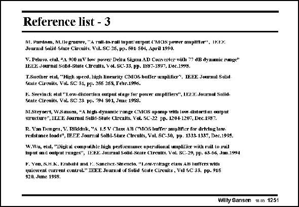

# SANSEN-1251 · Reference list - 3

章节：12 AB 类放大器与驱动放大器  
PDF 页：355；书本页：362；幻灯片编号：1251  
状态：unreviewed



## 对应教材讲解

本页为参考文献幻灯片；已查看原 PDF，原页没有另外的正文讲解。

## 公式／性能结论候选摘录

以下为规则截取的原文，尚未逐项判读。

（未由规则找到；不代表原页没有此类内容。）

## 曲线结论候选摘录

以下为规则截取的原文，尚未逐项判读。

（未由规则找到；不代表原页没有此类内容。）

## 原文条件与近似候选摘录

以下为规则截取的原文，尚未逐项判读。

（未由规则找到；不代表原页没有此类内容。）

## 幻灯片 OCR（未校正）

```text
Reference list - 3
M. Pardoeh, M.Deganwe, "A lall-to-roll inpuc nerput CMOs power aputer", IoEk:
Juuranl Solid Stale Circuits, Vul. SC 25, pp. 501-504, Apri 1990.
V. Peluvo, clal, *,1 900 mV Ione powver Delta Siuma AD Conserter with 7? dB dynanic roge"
HGIEL Journal Solld-State Ctrtults, VOl. SC-33, PP. 1897-1897, Dec.1998,
T.Sacther etal, "High speed, high linearity CMOS buffer auplifier", IE.EE Jou'nal Solid
Stute Circnits, Vol SC 3L, pp. 255 258, Febr.1996.
15. Seevinck etal "Low-distortion ouput stage for power ampliflers", LEEE Journsl Solid.
State Cirenits, Vol. SC: 23 pp. 794 S01, Jmac 1958.
M.Steyoert, W.Smisen, "A high dynamte range CVOS opomp with low. distordon ourput
structure", ILE'L Journal Soud-State Circults. VoL. SC-22 PD. 1204-1207, Dec. 1992.
R. Van Dongeu, V. Rikkink, 'A 1.5 V Class AR CMOS bufTe ampHfer for ditving law.
resstance loads", IE,EE Journal SoHd-Stare Chrenits, Vol. SC-30, pp. 1333-1337, Dec.1995.
W.Wu, etd, "Diwital compwible ligh pestormanee operstional smpliliee with ruil to rail
tput and output rauges'*, IEEE Jourual Solid-State Circults, Vol. SC-29, pp. 63.66, .Jau.1994
M. You, S.H.K. Embabl and t.. Sanchez.Sinenclo. "Low-vntrage class 4H butters with
quieseent eurread control" TEEE Jourasd of Solid State Cireuits, Vol SC: 33, pp. 915
920. Jume 1998.
Wilty Sansen M.ns 1251
```

数学上下标、分数及正负号以原图为准。电路图已保留；未核对的连接不输出成可仿真 netlist。
