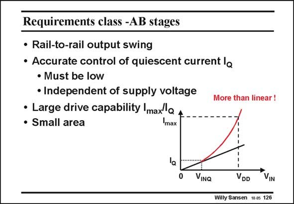

# SANSEN-126 · Requirements class -AB stages

章节：12 AB 类放大器与驱动放大器  
PDF 页：332；书本页：339；幻灯片编号：126  
状态：unreviewed



## 对应教材讲解

### PDF 332 · 书本 339

The first requirement is obviously that rail-to-rail swings are possible. The second one has indeed to do with the quiescent current I . Q In addition, large output currents I must be posmax sible (depending on the application). Their ratio to I is called the drive Q capability. The problem is that the transfer curve of such an amplifier is now highly nonlinear. For small input voltages, it is perfectly linear, as any class-A amplifier. For higher input voltages, the output current must rise more than linearly with the input voltages. The output current must have an expanding characteristic. This will generate some distortion as well, which can be reduced by application of feedback. This is why many class-AB stages consist of three stages. The last specification has to do with complexity. Class-AB amplifiers are the most complicated DC-coupled amplifiers. Some simplicity is still welcome!

## 公式／性能结论候选摘录

以下为规则截取的原文，尚未逐项判读。

- PDF 332: Q In addition, large output currents I must be posmax sible (depending on the application).

## 曲线结论候选摘录

以下为规则截取的原文，尚未逐项判读。

- PDF 332: The problem is that the transfer curve of such an amplifier is now highly nonlinear.
- PDF 332: The output current must have an expanding characteristic.

## 原文条件与近似候选摘录

以下为规则截取的原文，尚未逐项判读。

（未由规则找到；不代表原页没有此类内容。）

## 幻灯片 OCR（未校正）

```text
Requirements class -AB stages
• Rail-to-rail output swing
• Accurate control of quiescent current la
• Must be low
• Independent of supply voltage
• Large drive capability Imax'a
• Small area
max
More than linear!
la
0
VINQ
VDD
VIN
Willy Sansen 10.0s 126
```

数学上下标、分数及正负号以原图为准。电路图已保留；未核对的连接不输出成可仿真 netlist。
