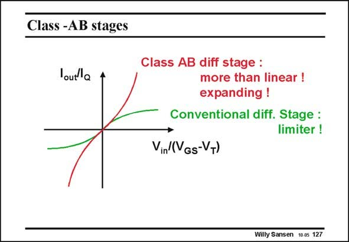

# SANSEN-127 · Class -AB stages

章节：12 AB 类放大器与驱动放大器  
PDF 页：333；书本页：340；幻灯片编号：127  
状态：unreviewed



## 对应教材讲解

### PDF 333 · 书本 340

A conventional differential pair has a limiting characteristic rather than an expanding one. It cannot be used in a class-AB amplifier. Circuit techniques will have to be devised to convert the limiting characteristic into an expanding one. The simplest solution is a conventional CMOS inverter amplifier!

## 公式／性能结论候选摘录

以下为规则截取的原文，尚未逐项判读。

- PDF 333: A conventional differential pair has a limiting characteristic rather than an expanding one.
- PDF 333: Circuit techniques will have to be devised to convert the limiting characteristic into an expanding one.

## 曲线结论候选摘录

以下为规则截取的原文，尚未逐项判读。

- PDF 333: A conventional differential pair has a limiting characteristic rather than an expanding one.
- PDF 333: Circuit techniques will have to be devised to convert the limiting characteristic into an expanding one.

## 原文条件与近似候选摘录

以下为规则截取的原文，尚未逐项判读。

（未由规则找到；不代表原页没有此类内容。）

## 幻灯片 OCR（未校正）

```text
Class -AB stages
lout a
Class AB diff stage :
more than linear !
expanding !
Conventional diff. Stage :
limiter !
Vin (VGs-VT)
Willy Sansen 10-05 127
```

数学上下标、分数及正负号以原图为准。电路图已保留；未核对的连接不输出成可仿真 netlist。
