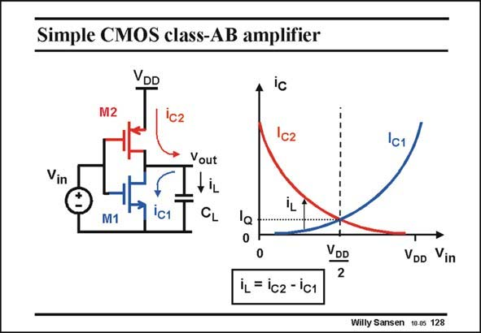

# SANSEN-128 · Simple CMOS class-AB amplifier

章节：12 AB 类放大器与驱动放大器  
PDF 页：333；书本页：340；幻灯片编号：128  
状态：unreviewed



## 对应教材讲解

### PDF 333 · 书本 340

A simple CMOS inverter is an excellent class-AB amplifier. Normally it is biased at a small current I . The cur- Q rent through the capacitive load however, can be much larger, because the transistor V can be as much as GS the full supply voltage. The actual load current i is L the difference between the nMOST current i and the C2 pMOST current i . C1 In this circuit the squarelaw characteristic of a MOST is used. It has an expanding characteristic indeed. The main disadvantage of this circuit is that its two V ’s are between supply voltage and GS ground. As a consequence, the quiescent current depends on the supply voltage. Moreover, all spikes on the supply voltage (from digital blocks) enter this amplifier. Its PSRR is thus zero dB. Other circuit solutions are now required.

## 公式／性能结论候选摘录

以下为规则截取的原文，尚未逐项判读。

- PDF 333: As a consequence, the quiescent current depends on the supply voltage.
- PDF 333: Its PSRR is thus zero dB.

## 曲线结论候选摘录

以下为规则截取的原文，尚未逐项判读。

- PDF 333: C1 In this circuit the squarelaw characteristic of a MOST is used.
- PDF 333: It has an expanding characteristic indeed.

## 原文条件与近似候选摘录

以下为规则截取的原文，尚未逐项判读。

- PDF 333: The cur- Q rent through the capacitive load however, can be much larger, because the transistor V can be as much as GS the full supply voltage.

## 幻灯片 OCR（未校正）

```text
Simple CMOS class-AB amplifier
VDD
Ic
M2
1c2
Ic2
Ic1
Vout
Vin
M1
ic1
iL
CL
la
VDD
2
VDD
Vin
iL = ic2 - ic1
Willy Sansen 10.0s 128
```

数学上下标、分数及正负号以原图为准。电路图已保留；未核对的连接不输出成可仿真 netlist。
