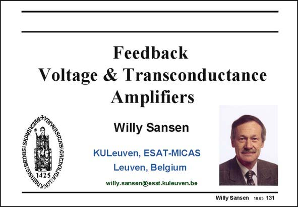

# SANSEN-131 · Slide 131

章节：13 反馈电压放大器与跨导放大器  
PDF 页：356；书本页：363；幻灯片编号：131  
状态：unreviewed



## 对应教材讲解

### PDF 356 · 书本 363

Feedback is used in almost all analog amplifiers and filters. A thorough understanding is therefore a necessity for whoever wants to build up insight in the art of analog circuit design. This understanding can be gradually developed by reviewing the principles and by applying them to the four basic types of feedback. Many publications and books are devoted to feedback. Most of them originate from circuit theory, however. They inevitably start from the description of the amplifier and the feedback network by means of matrices. This very formal approach is not always necessary. In most cases, the concepts of open and closed-loop gain and of the loop gain are sufficient to obtain the most important specifications such as the closed-loop gain, the bandwidth and the input-and output impedances. For the impedance at an inner node, the rule of Blackman is necessary. On the other hand, most designers could not care less about the inner nodes. Therefore, Blackman is omitted. The simplest possible approach is envisaged here to learn all about feedback. In this Chapter, we focus first on voltage and transconductance amplifiers. The next chapter will introduce transimpedance and current amplifiers.

## 公式／性能结论候选摘录

以下为规则截取的原文，尚未逐项判读。

- PDF 356: A thorough understanding is therefore a necessity for whoever wants to build up insight in the art of analog circuit design.
- PDF 356: In most cases, the concepts of open and closed-loop gain and of the loop gain are sufficient to obtain the most important specifications such as the closed-loop gain, the bandwidth and the input-and output impedances.
- PDF 356: Therefore, Blackman is omitted.

## 曲线结论候选摘录

以下为规则截取的原文，尚未逐项判读。

（未由规则找到；不代表原页没有此类内容。）

## 原文条件与近似候选摘录

以下为规则截取的原文，尚未逐项判读。

（未由规则找到；不代表原页没有此类内容。）

## 幻灯片 OCR（未校正）

```text
Feedback
Voltage & Transconductance
Amplifiers
Willy Sansen
KULeuven, ESAT-MICAS
Leuven, Belgium
willy.sansen@esat.kuleuven.be
Willy Sansen 1005 131
```

数学上下标、分数及正负号以原图为准。电路图已保留；未核对的连接不输出成可仿真 netlist。
