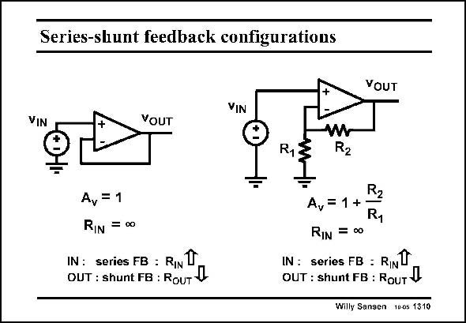

# SANSEN-1310 · Series-shunt feedback configurations

章节：13 反馈电压放大器与跨导放大器  
PDF 页：361；书本页：368；幻灯片编号：1310  
状态：unreviewed



## 对应教材讲解

### PDF 361 · 书本 368

If we feed back the output voltage in series with the input, we obtain a seriesshunt feedback loop. In its simplest case, the output is directly connected to the input, yielding a gain of unity. For an opamp with high gain, the difference between the terminals is approximately zero, whatever the output may be. This circuit is called a buffer amplifier as it can deliver a lot of current without loss in voltage gain. More often however, a few resistors are used to set the gain at a precise value. The gain is positive as the output is in phase with the input. It is therefore a non-inverting amplifier. Since the input is directly connected to the Gate of a MOST, the input current is zero and the input resistance infinity. No current flows through the input voltage source (or input sensor). Later we will prove that the input resistance goes up because of the series feedback at the input. Parallel or shunt feedback always causes the resistance to go down. The output resistance therefore goes down. This feedback causes this amplifier to behave as a voltage-to-voltage amplifier. Indeed, the voltage is sensed at the input, without drawing current. At the output, the amplifier behaves as a voltage source. Series-shunt feedback turns amplifiers in ideal voltage-tovoltage amplifiers with precise voltage gain!

## 公式／性能结论候选摘录

以下为规则截取的原文，尚未逐项判读。

- PDF 361: In its simplest case, the output is directly connected to the input, yielding a gain of unity.
- PDF 361: For an opamp with high gain, the difference between the terminals is approximately zero, whatever the output may be.
- PDF 361: This circuit is called a buffer amplifier as it can deliver a lot of current without loss in voltage gain.
- PDF 361: More often however, a few resistors are used to set the gain at a precise value.
- PDF 361: The gain is positive as the output is in phase with the input.
- PDF 361: It is therefore a non-inverting amplifier.
- PDF 361: The output resistance therefore goes down.
- PDF 361: Series-shunt feedback turns amplifiers in ideal voltage-tovoltage amplifiers with precise voltage gain!

## 曲线结论候选摘录

以下为规则截取的原文，尚未逐项判读。

- PDF 361: The gain is positive as the output is in phase with the input.

## 原文条件与近似候选摘录

以下为规则截取的原文，尚未逐项判读。

- PDF 361: For an opamp with high gain, the difference between the terminals is approximately zero, whatever the output may be.

## 幻灯片 OCR（未校正）

```text
Series-shunt feedback configurations
YOUT
VIN
VOUT
W
R1
A, = 1
RIN =00
IN : series FB : RIN
OUT : shunt FB : RouT V
A, = 1 +
Ry
RIN = 00
IN: series FB : RINT
OUT : shunt FB : RouT V
Willy Sansen 1005 1310
```

数学上下标、分数及正负号以原图为准。电路图已保留；未核对的连接不输出成可仿真 netlist。
