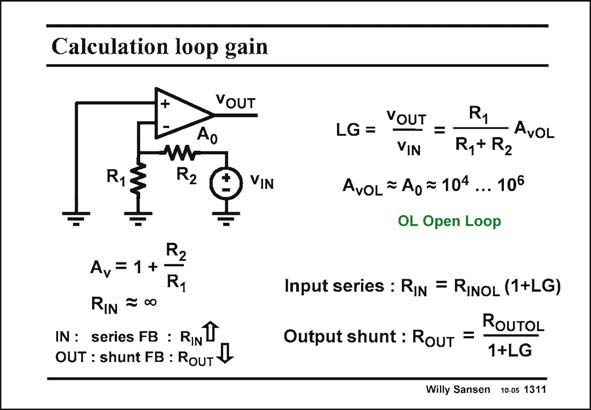

# SANSEN-1311 · Calculation loop gain

章节：13 反馈电压放大器与跨导放大器  
PDF 页：361；书本页：368；幻灯片编号：1311  
状态：unreviewed



## 对应教材讲解

### PDF 361 · 书本 368

In order to figure out how much the input and output resistances change, we have to find the loop gain first. For this purpose, we try to find an easy place to break the loop. Outputs of opamps generally have low output resistances already without feedback. Breaking the loop right after the output is thus a good choice. Of course we could also break the loop right before the minus input of the opamp, as we see an infinite resistance into the amplifier. The voltage gain around the loop is then easily found. It is attenuated first by the resistor ratio, followed by the total open-loop gain A of the opamp. 0

### PDF 362 · 书本 369

As a result, the input resistance, which was already quite high, increases even more. The output resistance decreases by the same amount.

## 公式／性能结论候选摘录

以下为规则截取的原文，尚未逐项判读。

- PDF 361: In order to figure out how much the input and output resistances change, we have to find the loop gain first.
- PDF 361: Breaking the loop right after the output is thus a good choice.
- PDF 361: The voltage gain around the loop is then easily found.
- PDF 361: It is attenuated first by the resistor ratio, followed by the total open-loop gain A of the opamp. 0
- PDF 362: As a result, the input resistance, which was already quite high, increases even more.
- PDF 362: The output resistance decreases by the same amount.

## 曲线结论候选摘录

以下为规则截取的原文，尚未逐项判读。

（未由规则找到；不代表原页没有此类内容。）

## 原文条件与近似候选摘录

以下为规则截取的原文，尚未逐项判读。

（未由规则找到；不代表原页没有此类内容。）

## 幻灯片 OCR（未校正）

```text
Calculation loop gain
VOUT
Ao
R13
R2
VIN
LG = YOUT = -
R1
- AvOL
VIN
R,+ R2
AvoL= Ao= 104 ... 106
OL Open Loop
R2
A, = 1+
RIN = 00
IN : series FB : RINT
OUT : shunt FB : RouT 4
Input series : RIn = RInoL (1+LG)
Output shunt : RouT =
ROUTOL
1+LG
Willy Sansen 10 0s 1311
```

数学上下标、分数及正负号以原图为准。电路图已保留；未核对的连接不输出成可仿真 netlist。
