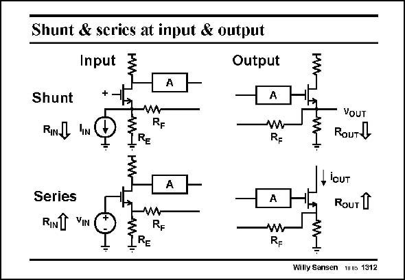

# SANSEN-1312 · Shunt & serics at input & output

章节：13 反馈电压放大器与跨导放大器  
PDF 页：362；书本页：369；幻灯片编号：1312  
状态：unreviewed



## 对应教材讲解

### PDF 362 · 书本 369

Let us now try to obtain some better insight in why series feedback increases the resistance and shunt feedback decreases it. Also, how can we try to remember this? All four combinations are shown in this slide. At the input, a transistor is shown to see how exactly the feedback resistors are connected. In all cases some more gain is added in the loop by means of gain block A. In the first case of input shunt feedback, a cascode transistor is used at the input. The input source is connected at the same node as the feedback resistor R . As a result, we will expect the input resistance to go F down. The same applies to the shunt output at the right. For input series feedback, the input signal source is not at the same node as the feedback resistor. Actually, a feedback voltage is added in series with the transistor input voltage. The input resistance is now expected to increase.

## 公式／性能结论候选摘录

以下为规则截取的原文，尚未逐项判读。

- PDF 362: Let us now try to obtain some better insight in why series feedback increases the resistance and shunt feedback decreases it.
- PDF 362: In all cases some more gain is added in the loop by means of gain block A.
- PDF 362: As a result, we will expect the input resistance to go F down.
- PDF 362: The input resistance is now expected to increase.

## 曲线结论候选摘录

以下为规则截取的原文，尚未逐项判读。

（未由规则找到；不代表原页没有此类内容。）

## 原文条件与近似候选摘录

以下为规则截取的原文，尚未逐项判读。

（未由规则找到；不代表原页没有此类内容。）

## 幻灯片 OCR（未校正）

```text
Shunt & serics at input & output
Input
+
Output
Shunt
RINL
.IN
ww
RF
VOUT
ROuTy
Series
RINT VIN
lOUT
Rouт 1
w
RF
_RE
Rp
Willy Sansen uus 1312
```

数学上下标、分数及正负号以原图为准。电路图已保留；未核对的连接不输出成可仿真 netlist。
