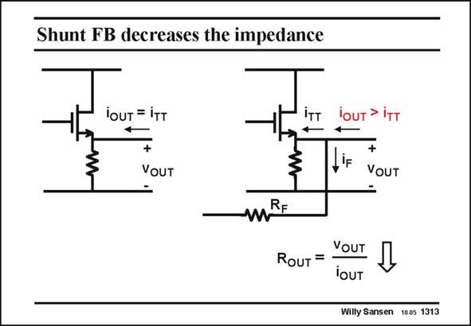

# SANSEN-1313 · Shunt FB decreases the impedance

章节：13 反馈电压放大器与跨导放大器  
PDF 页：362；书本页：369；幻灯片编号：1313  
状态：unreviewed



## 对应教材讲解

### PDF 362 · 书本 369

Indeed, shunt feedback, shown here at the output of an amplifier, causes the output current to increase. This output current i is OUT the current flowing through some output load, not shown in this diagram. This output current i OUT splits up towards the amplifier i and towards the TT feedback resistor i . The F total output current will be larger than without feedback. As a result, the ratio v /i , which is the OUT OUT output resistance R , will OUT decrease.

## 公式／性能结论候选摘录

以下为规则截取的原文，尚未逐项判读。

- PDF 362: Indeed, shunt feedback, shown here at the output of an amplifier, causes the output current to increase.
- PDF 362: As a result, the ratio v /i , which is the OUT OUT output resistance R , will OUT decrease.

## 曲线结论候选摘录

以下为规则截取的原文，尚未逐项判读。

（未由规则找到；不代表原页没有此类内容。）

## 原文条件与近似候选摘录

以下为规则截取的原文，尚未逐项判读。

（未由规则找到；不代表原页没有此类内容。）

## 幻灯片 OCR（未校正）

```text
Shunt FB decreases the impedance
lOUT = iTT
7
VOUT
lOUT>
fiF
+
VoUT
mRE
ROUT = YOUT
joUT
Willy Sansen 1005 1313
```

数学上下标、分数及正负号以原图为准。电路图已保留；未核对的连接不输出成可仿真 netlist。
