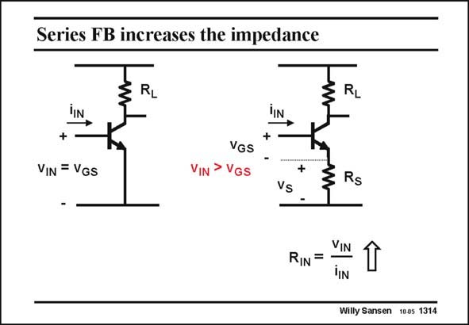

# SANSEN-1314 · Series FB increases the impedance

章节：13 反馈电压放大器与跨导放大器  
PDF 页：363；书本页：370；幻灯片编号：1314  
状态：unreviewed



## 对应教材讲解

### PDF 363 · 书本 370

In the same way, series feedback, shown here at the input of an amplifier, causes the input voltage to increase. This input voltage v is the total voltage from IN gate to ground. It is the sum of the actual transistor v GS and the voltage v across the S feedback resistor R . S The total input voltage will therefore be larger than without feedback. As a result, the ratio v /i , IN IN which is the input resistance R , will increase by the IN amount of loop gain realized by the feedback loop.

## 公式／性能结论候选摘录

以下为规则截取的原文，尚未逐项判读。

- PDF 363: In the same way, series feedback, shown here at the input of an amplifier, causes the input voltage to increase.
- PDF 363: S The total input voltage will therefore be larger than without feedback.
- PDF 363: As a result, the ratio v /i , IN IN which is the input resistance R , will increase by the IN amount of loop gain realized by the feedback loop.

## 曲线结论候选摘录

以下为规则截取的原文，尚未逐项判读。

（未由规则找到；不代表原页没有此类内容。）

## 原文条件与近似候选摘录

以下为规则截取的原文，尚未逐项判读。

（未由规则找到；不代表原页没有此类内容。）

## 幻灯片 OCR（未校正）

```text
Series FB increases the impedance
HIN
+
VIN = VGS
-
3
RL
RL
+
VGS
VIN > VGS
+
Vs
-
Rs
RIN=
VIN
YIN
Willy Sansen 1005 1314
```

数学上下标、分数及正负号以原图为准。电路图已保留；未核对的连接不输出成可仿真 netlist。
