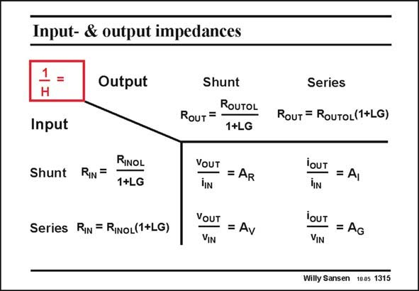

# SANSEN-1315 · Input- & output impedances

章节：13 反馈电压放大器与跨导放大器  
PDF 页：363；书本页：370；幻灯片编号：1315  
状态：unreviewed



## 对应教材讲解

### PDF 363 · 书本 370

The different kinds of feedback give rise to different kinds of amplifiers. We have already seen that seriesshunt feedback provides an amplifier with high precision in voltage gain A . V In a similar way, a shuntshunt feedback amplifier generates an accurate transresistance gain A . Both R input and output resistances will decrease. The input can easily be driven by means of an input current source. The output behaves as a voltage source. In order to make a good current amplifier, we will have to apply shunt-series feedback. The input resistance is lowered to be able to allow the input current to flow. The output resistance is quite high, as for any current source. Finally, for a transconductance amplifier, we will need to use series-series feedback. Why do we need all these different kinds of amplifiers?

## 公式／性能结论候选摘录

以下为规则截取的原文，尚未逐项判读。

- PDF 363: We have already seen that seriesshunt feedback provides an amplifier with high precision in voltage gain A .
- PDF 363: V In a similar way, a shuntshunt feedback amplifier generates an accurate transresistance gain A .
- PDF 363: Both R input and output resistances will decrease.

## 曲线结论候选摘录

以下为规则截取的原文，尚未逐项判读。

（未由规则找到；不代表原页没有此类内容。）

## 原文条件与近似候选摘录

以下为规则截取的原文，尚未逐项判读。

（未由规则找到；不代表原页没有此类内容。）

## 幻灯片 OCR（未校正）

```text
Input- & output impedances
1 =
H
Input
Output
Shunt
RIN =
RINOL
1+LG
Series RIN = RiNoL(1+LG)
Shunt
ROUTOL
RouT=
1+LG
VOUT = AR
YOUT = Av
Series
RouT = RouToL(1+LG)
iOUT = Al
iIN
iOUT = AG
VIN
Willy Sansen 1005 1315
```

数学上下标、分数及正负号以原图为准。电路图已保留；未核对的连接不输出成可仿真 netlist。
