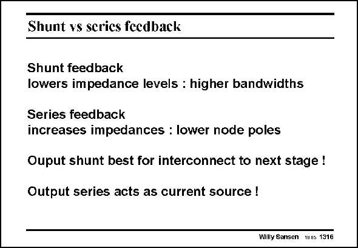

# SANSEN-1316 · Shunt vs serics fcedback

章节：13 反馈电压放大器与跨导放大器  
PDF 页：364；书本页：371；幻灯片编号：1316  
状态：unreviewed



## 对应教材讲解

### PDF 364 · 书本 371

Shunt feedback will be used when we want to decrease the impedance level of an interconnection between two circuit blocks. Such interconnects can pick up a lot of parasitic capacitance. This causes a severe reduction in bandwidth when the interconnect is at too high an impedance level. On the contrary, in an operational amplifier we want to create a low-frequency dominant pole by means of one single capacitance. Series feedback is a great help in increasing the node impedance. Also sometimes a real current source must be built. For example, to carry out an impedance measurement we need to apply a precise current and to measure the voltage generated across it. As a result, we need to generate a circuit with high output impedance and a precise current. Output series feedback is ideal for this kind of application.

## 公式／性能结论候选摘录

以下为规则截取的原文，尚未逐项判读。

- PDF 364: Shunt feedback will be used when we want to decrease the impedance level of an interconnection between two circuit blocks.
- PDF 364: This causes a severe reduction in bandwidth when the interconnect is at too high an impedance level.
- PDF 364: As a result, we need to generate a circuit with high output impedance and a precise current.

## 曲线结论候选摘录

以下为规则截取的原文，尚未逐项判读。

（未由规则找到；不代表原页没有此类内容。）

## 原文条件与近似候选摘录

以下为规则截取的原文，尚未逐项判读。

（未由规则找到；不代表原页没有此类内容。）

## 幻灯片 OCR（未校正）

```text
Shunt vs serics fcedback
Shunt feedback
lowers impedance levels : higher bandwidths
Series feedback
increases impedances : lower node poles
Ouput shunt best for interconnect to next stage !
Output series acts as current source !
Willy Sansen mus 1316
```

数学上下标、分数及正负号以原图为准。电路图已保留；未核对的连接不输出成可仿真 netlist。
