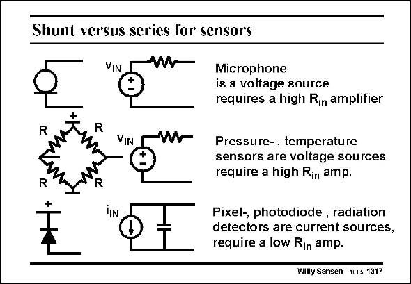

# SANSEN-1317 · Shunt versus serics for sensors

章节：13 反馈电压放大器与跨导放大器  
PDF 页：364；书本页：371；幻灯片编号：1317  
状态：unreviewed



## 对应教材讲解

### PDF 364 · 书本 371

At the input, it is mainly the kind of sensor which determines whether we need a voltage input or a current sensing input. A dynamic microphone for example, behaves as a voltage source: it has a small internal resistance. The voltage carries the sensor information. We need therefore, to measure the voltage at the input. We also need a high input resistance or series feedback at the input. This also applies to a Wheatstone bridge with pressure sensors, and to thermisters. On the other hand, if we have a capacitive pressure sensor or accelerometer, or a photodiode, then we need a current amplifier. They all have a small capacitor as an internal impedance, quite often as low as 10 pF. Its impedance is quite high at low frequencies. It is the current which carries the sensor information. We need a current measurement, or shunt feedback at the input. If we want a voltage output, we will have to take a shunt-shunt feedback amplifier.

## 公式／性能结论候选摘录

以下为规则截取的原文，尚未逐项判读。

- PDF 364: We need therefore, to measure the voltage at the input.

## 曲线结论候选摘录

以下为规则截取的原文，尚未逐项判读。

（未由规则找到；不代表原页没有此类内容。）

## 原文条件与近似候选摘录

以下为规则截取的原文，尚未逐项判读。

（未由规则找到；不代表原页没有此类内容。）

## 幻灯片 OCR（未校正）

```text
Shunt versus serics for sensors
VIN
R
VIN
Microphone
is a voltage source
requires a high Rin amplifier
Pressure-, temperature
sensors are voltage sources
require a high Rin amp.
Pixel-, photodiode, radiation
detectors are current sources,
require a low Rin amp.
Willy Sansen muus 1317
```

数学上下标、分数及正负号以原图为准。电路图已保留；未核对的连接不输出成可仿真 netlist。
