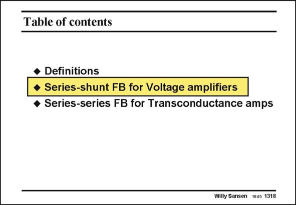

# SANSEN-1318 · Table of contents

章节：13 反馈电压放大器与跨导放大器  
PDF 页：365；书本页：372；幻灯片编号：1318  
状态：unreviewed



## 对应教材讲解

### PDF 365 · 书本 372

Let us now discuss seriesshunt feedback in more detail. It is a kind of amplifier which provides an accurate voltage-to-voltage conversion, as in preamplifiers for pressure sensors. They are evidently called voltage amplifiers. This time we will assume a more general case, i.e. the input impedance is not infinite any more but has a limited value. Also, the output resistance is no longer zero. We want to calculate again the loop gain, the closed and open-loop gains, and finally the input and output resistances. Afterwards, series-series feedback will be discussed. They will measure a voltage and provide an output current. This is why they are called transconductance amplifiers. They share the high input resistance with voltage amplifiers. Both have series feedback at the input.

## 公式／性能结论候选摘录

以下为规则截取的原文，尚未逐项判读。

- PDF 365: This time we will assume a more general case, i.e. the input impedance is not infinite any more but has a limited value.
- PDF 365: We want to calculate again the loop gain, the closed and open-loop gains, and finally the input and output resistances.

## 曲线结论候选摘录

以下为规则截取的原文，尚未逐项判读。

（未由规则找到；不代表原页没有此类内容。）

## 原文条件与近似候选摘录

以下为规则截取的原文，尚未逐项判读。

- PDF 365: This time we will assume a more general case, i.e. the input impedance is not infinite any more but has a limited value.

## 幻灯片 OCR（未校正）

```text
Table of contents
• Definitions
• Series-shunt FB for Voltage amplifiers
• Series-series FB for Transconductance amps
Willy Sansen 1005 1318
```

数学上下标、分数及正负号以原图为准。电路图已保留；未核对的连接不输出成可仿真 netlist。
