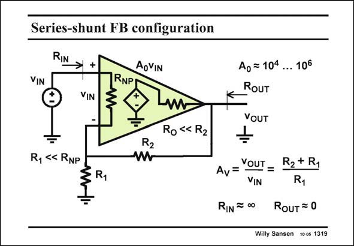

# SANSEN-1319 · Series-shunt FB configuration

章节：13 反馈电压放大器与跨导放大器  
PDF 页：365；书本页：372；幻灯片编号：1319  
状态：unreviewed



## 对应教材讲解

### PDF 365 · 书本 372

A general-purpose amplifier is shown in this slide, with series-shunt feedback around it. The amplifier has a lot of gain A . It is mod- 0 eled by a voltage controlled voltage source A v . Its 0 IN input resistance R is high NP but not infinite. It is certainly larger than resistor R . 1 Its output resistance R is O small but not zero. Feedback resistor R is a 2 lot larger than R . O The closed-loop gain is evidently the ratio of the two resistors, as indicated in this slide. The input resistance will increase as a result of the feedback. It is now quasi infinite. The output resistance will decrease as a result of the feedback. It is now quasi zero. What are the actual values?

## 公式／性能结论候选摘录

以下为规则截取的原文，尚未逐项判读。

- PDF 365: The amplifier has a lot of gain A .
- PDF 365: O The closed-loop gain is evidently the ratio of the two resistors, as indicated in this slide.
- PDF 365: The input resistance will increase as a result of the feedback.
- PDF 365: The output resistance will decrease as a result of the feedback.

## 曲线结论候选摘录

以下为规则截取的原文，尚未逐项判读。

（未由规则找到；不代表原页没有此类内容。）

## 原文条件与近似候选摘录

以下为规则截取的原文，尚未逐项判读。

（未由规则找到；不代表原页没有此类内容。）

## 幻灯片 OCR（未校正）

```text
Series-shunt FB configuration
RIN
+
VIN
VIN
RNP
AoVIN
R2
Ro « R2
Ag=104... 106
RoUT
YOUT
R1
Av= YOUT = R2+ Ry
RIN # 00 RoUT = 0
Willy Sansen 10 0s 1319
```

数学上下标、分数及正负号以原图为准。电路图已保留；未核对的连接不输出成可仿真 netlist。
