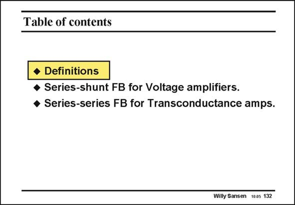

# SANSEN-132 · Table of contents

章节：13 反馈电压放大器与跨导放大器  
PDF 页：356；书本页：363；幻灯片编号：132  
状态：unreviewed



## 对应教材讲解

### PDF 356 · 书本 363

First of all, we want to learn about the definitions. For example, what is the actual loop gain? For large values of the loop gain, it is the ratio of the open-loop gain and the closed-loop gain, or simply the difference if we use dB. For example, an operational amplifier (shortened to opamp) with an open-loop gain of 85 dB, which is used in a negative feedback loop resulting in a gain of 10 or 20 dB, has a loop gain of 65 dB. This loop gain is the gain by which the characteristics of the amplifier are improved such as the precision of the gain. It also reduces the noise and the distortion, but above all it improves the bandwidth a great deal.

### PDF 357 · 书本 364

We will look into these phenomena at a later stage. We first want to examine the four cases of feedback. The input can be connected in parallel (shunt) or in series, giving rise to four different cases. In this Chapter we will focus on voltage and transconductance amplifiers. Both types of feedback circuits take voltages at the input.

## 公式／性能结论候选摘录

以下为规则截取的原文，尚未逐项判读。

- PDF 356: For example, what is the actual loop gain?
- PDF 356: For large values of the loop gain, it is the ratio of the open-loop gain and the closed-loop gain, or simply the difference if we use dB.
- PDF 356: For example, an operational amplifier (shortened to opamp) with an open-loop gain of 85 dB, which is used in a negative feedback loop resulting in a gain of 10 or 20 dB, has a loop gain of 65 dB.
- PDF 356: This loop gain is the gain by which the characteristics of the amplifier are improved such as the precision of the gain.
- PDF 356: It also reduces the noise and the distortion, but above all it improves the bandwidth a great deal.

## 曲线结论候选摘录

以下为规则截取的原文，尚未逐项判读。

- PDF 356: This loop gain is the gain by which the characteristics of the amplifier are improved such as the precision of the gain.

## 原文条件与近似候选摘录

以下为规则截取的原文，尚未逐项判读。

（未由规则找到；不代表原页没有此类内容。）

## 幻灯片 OCR（未校正）

```text
Table of contents
• Definitions
• Series-shunt FB for Voltage amplifiers.
• Series-series FB for Transconductance amps.
Willy Sansen 1005 132
```

数学上下标、分数及正负号以原图为准。电路图已保留；未核对的连接不输出成可仿真 netlist。
