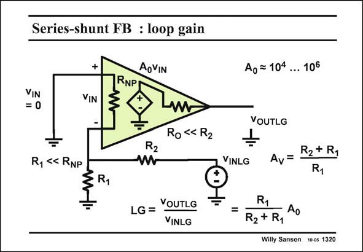

# SANSEN-1320 · Series-shunt FB : loop gain

章节：13 反馈电压放大器与跨导放大器  
PDF 页：366；书本页：373；幻灯片编号：1320  
状态：unreviewed



## 对应教材讲解

### PDF 366 · 书本 373

To obtain the actual values we have to find the loop gain LG first. The loop is broken at the output of the opamp. The input voltage v is set to IN zero. The loop gain LG is the ratio of the output voltage v to the input voltage OUTLG v . It is easily found to INLG be the open loop gain A 0 divided by the closed-loop gain A . v The loop gain LG is now quite large indeed, since A 0 is so large.

## 公式／性能结论候选摘录

以下为规则截取的原文，尚未逐项判读。

- PDF 366: To obtain the actual values we have to find the loop gain LG first.
- PDF 366: The loop gain LG is the ratio of the output voltage v to the input voltage OUTLG v .
- PDF 366: It is easily found to INLG be the open loop gain A 0 divided by the closed-loop gain A . v The loop gain LG is now quite large indeed, since A 0 is so large.

## 曲线结论候选摘录

以下为规则截取的原文，尚未逐项判读。

（未由规则找到；不代表原页没有此类内容。）

## 原文条件与近似候选摘录

以下为规则截取的原文，尚未逐项判读。

（未由规则找到；不代表原页没有此类内容。）

## 幻灯片 OCR（未校正）

```text
Series-shunt FB : loop gain
AoVIN
VIN
= 0
+
VIN
RNP
Ro «R2
R2
R, < RNP
§R1
LG =
VOUTLG
VINLG
Ao = 104 ... 106
VOUTLG
VINLG
Av=
R2+ R1
R1
=
R1
• Ao
R2+ R1
Willy Sansen 10 os 1320
```

数学上下标、分数及正负号以原图为准。电路图已保留；未核对的连接不输出成可仿真 netlist。
