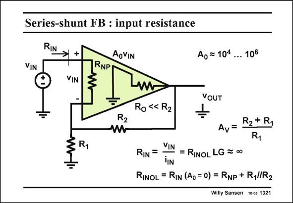

# SANSEN-1321 · Series-shunt FB : input resistance

章节：13 反馈电压放大器与跨导放大器  
PDF 页：366；书本页：373；幻灯片编号：1321  
状态：unreviewed



## 对应教材讲解

### PDF 366 · 书本 373

The input resistance R is IN now the open-loop input resistance R multiplied INOL by the loop gain LG. The open-loop input resistance R is simply INOL the sum of the large input resistor R and the feed- NP back resistors in parallel. Output resistance R is O small and therefore negligible with respect to the others. This input resistance R is about infinity for a INOL MOST amplifier but not for a bipolar one. Application of series feedback will make the closed-loop input resistance R near IN infinity for a bipolar amplifier. Note that for the calculation of the open-loop input resistance, the effect of the feedback must be eliminated. This is easily done by setting the gain A to zero. 0

## 公式／性能结论候选摘录

以下为规则截取的原文，尚未逐项判读。

- PDF 366: The input resistance R is IN now the open-loop input resistance R multiplied INOL by the loop gain LG.
- PDF 366: Output resistance R is O small and therefore negligible with respect to the others.
- PDF 366: This is easily done by setting the gain A to zero. 0

## 曲线结论候选摘录

以下为规则截取的原文，尚未逐项判读。

（未由规则找到；不代表原页没有此类内容。）

## 原文条件与近似候选摘录

以下为规则截取的原文，尚未逐项判读。

（未由规则找到；不代表原页没有此类内容。）

## 幻灯片 OCR（未校正）

```text
Series-shunt FB : input resistance
VIN
RIN
+
VIN
RNP
AoVIN
Ag =104... 106
R2
R1
W
Ro « R2
YOUT
R2+ R1
Av=
R1
VIN
RIN
=
= RINOL LG = ∞
iIN
RINOL = RIN (Ao= 0) = RNp + Ryl/R2
Willy Sansen 10 0s 1321
```

数学上下标、分数及正负号以原图为准。电路图已保留；未核对的连接不输出成可仿真 netlist。
