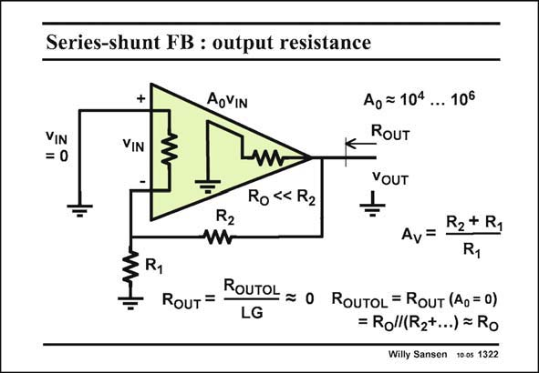

# SANSEN-1322 · Series-shunt FB : output resistance

章节：13 反馈电压放大器与跨导放大器  
PDF 页：367；书本页：374；幻灯片编号：1322  
状态：unreviewed



## 对应教材讲解

### PDF 367 · 书本 374

The output resistance R OUT is the open-loop output resistance R divided OUTOL by the loop gain LG. The open-loop output resistance R is the par- OUTOL allel combination of the small output resistor R and O the feedback resistors in series. Since output resistance R is small, the effect O of the feedback resistors is negligible. Application of shunt feedback will make the closedloop output resistance R OUT nearly zero. Note that for the calculation of the open-loop output resistance, the effect of the feedback must be eliminated. This is again done by setting the gain A to zero. 0

## 公式／性能结论候选摘录

以下为规则截取的原文，尚未逐项判读。

- PDF 367: The output resistance R OUT is the open-loop output resistance R divided OUTOL by the loop gain LG.
- PDF 367: This is again done by setting the gain A to zero. 0

## 曲线结论候选摘录

以下为规则截取的原文，尚未逐项判读。

（未由规则找到；不代表原页没有此类内容。）

## 原文条件与近似候选摘录

以下为规则截取的原文，尚未逐项判读。

（未由规则找到；不代表原页没有此类内容。）

## 幻灯片 OCR（未校正）

```text
Series-shunt FB : output resistance
VIN
= 0
+
VIN
AoVIN
§R1
R2
Ro « R2
Ag=104... 106
RoUT
YOUT
R2+ R1
Av=
R1
ROUT = -
ROUTOL = O ROUTOL = RouT (A,=0)
LG
= Roll(R2+...) = Ro
Willy Sansen 10 os 1322
```

数学上下标、分数及正负号以原图为准。电路图已保留；未核对的连接不输出成可仿真 netlist。
