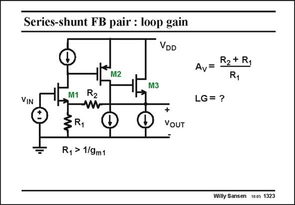

# SANSEN-1323 · Series-shunt FB pair : loop gain

章节：13 反馈电压放大器与跨导放大器  
PDF 页：367；书本页：374；幻灯片编号：1323  
状态：unreviewed



## 对应教材讲解

### PDF 367 · 书本 374

A popular series-shunt feedback amplifier is shown in this slide. It contains only a few transistors. It has two amplifiers M1 and M2 and a source follower. It is called a series-shunt feedback pair. The source follower does not seem to count and yet it provides a lot more loop gain as we will find out next. Note that a pMOST is used as a second amplifier as it provides easier DC biasing. Indeed the Sources of transistors M1 and M3 are at nearly equal DC voltage levels. Transistor M2 must now provide a lower DC voltage at the output than at the input. This is a lot easier with a pMOST than with an nMOST. Note also that the feedback resistor is usually larger than 1/g to make sure that all the m1 feedback current coming from R flows into the transistor, in order to increase the loop gain. 2 This is not always obvious however, as shown next. We need to know more about the input resistance at the Source of transistor M1. After all, transistor M1 behaves as a cascode transistor for the feedback current. What then is its input resistance? This is reviewed on the next slide.

## 公式／性能结论候选摘录

以下为规则截取的原文，尚未逐项判读。

- PDF 367: The source follower does not seem to count and yet it provides a lot more loop gain as we will find out next.
- PDF 367: Indeed the Sources of transistors M1 and M3 are at nearly equal DC voltage levels.
- PDF 367: Note also that the feedback resistor is usually larger than 1/g to make sure that all the m1 feedback current coming from R flows into the transistor, in order to increase the loop gain. 2 This is not always obvious however, as shown next.

## 曲线结论候选摘录

以下为规则截取的原文，尚未逐项判读。

（未由规则找到；不代表原页没有此类内容。）

## 原文条件与近似候选摘录

以下为规则截取的原文，尚未逐项判读。

（未由规则找到；不代表原页没有此类内容。）

## 幻灯片 OCR（未校正）

```text
Series-shunt FB pair : loop gain
VDD
M2
M3
Av= R2+Ry
R1
VIN
™ Rủ
LG= ?
+
VoUT
R, > 1/9m1
Willy Sansen 1005 1323
```

数学上下标、分数及正负号以原图为准。电路图已保留；未核对的连接不输出成可仿真 netlist。
