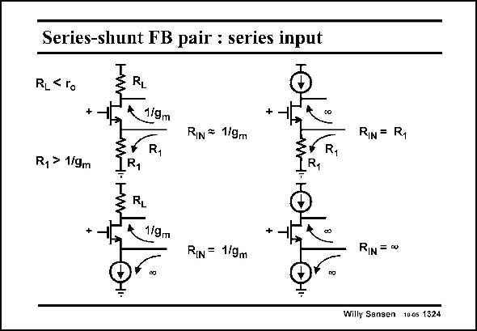

# SANSEN-1324 · Series-shunt FB pair : series input

章节：13 反馈电压放大器与跨导放大器  
PDF 页：368；书本页：375；幻灯片编号：1324  
状态：unreviewed



## 对应教材讲解

### PDF 368 · 书本 375

Input transistor M1 behaves as a cascode transistor indeed, for the feedback current. Its input resistance is calculated in all possible cases of Source resistance R 1 (or current source) and all possible cases of load resistor R (or current source). L It is clear that the feedback current can only flow into the Source if the cascode input resistance R is IN small (which is 1/g ). This m1 is the case when a small load resistor R is used. L When a current source is used as a load then input resistance R is high. The question is, IN what would the output voltage of that transistor would be? We need to know, to be able to find the loop gain.

## 公式／性能结论候选摘录

以下为规则截取的原文，尚未逐项判读。

- PDF 368: We need to know, to be able to find the loop gain.

## 曲线结论候选摘录

以下为规则截取的原文，尚未逐项判读。

（未由规则找到；不代表原页没有此类内容。）

## 原文条件与近似候选摘录

以下为规则截取的原文，尚未逐项判读。

（未由规则找到；不代表原页没有此类内容。）

## 幻灯片 OCR（未校正）

```text
Series-shunt FB pair : series input
RL< 1o
RL
+
1/9m
R1
RIN # 1/9m
RIN = R,
R
R1 > 1/9m
R,
RL
1/9mm
RIN = 1/9m
RIN = w
Willy Sangen 10-05 1324
```

数学上下标、分数及正负号以原图为准。电路图已保留；未核对的连接不输出成可仿真 netlist。
