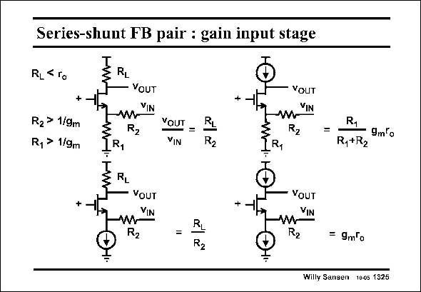

# SANSEN-1325 · Series-shunt FB pair : gain input stage

章节：13 反馈电压放大器与跨导放大器  
PDF 页：368；书本页：375；幻灯片编号：1325  
状态：unreviewed



## 对应教材讲解

### PDF 368 · 书本 375

In order to be able to find the loop gain, we must first of all, find the output voltage v at the Drain of OUT input transistor M1, as a result of an input voltage v IN applied to the feedback transistors, as shown in this slide. Again, four cases can be distinguished. When a small load resistor R is used, the gain is L easily found to be the ratio of the two resistors R and L R . It is usually not very L large! This gain is much larger however, when a current source is used as a load. Then the gain of the input transistor M1 comes in. This is not unexpected. A current source as a load usually provides higher gains!

## 公式／性能结论候选摘录

以下为规则截取的原文，尚未逐项判读。

- PDF 368: In order to be able to find the loop gain, we must first of all, find the output voltage v at the Drain of OUT input transistor M1, as a result of an input voltage v IN applied to the feedback transistors, as shown in this slide.
- PDF 368: When a small load resistor R is used, the gain is L easily found to be the ratio of the two resistors R and L R .
- PDF 368: This gain is much larger however, when a current source is used as a load.
- PDF 368: Then the gain of the input transistor M1 comes in.

## 曲线结论候选摘录

以下为规则截取的原文，尚未逐项判读。

（未由规则找到；不代表原页没有此类内容。）

## 原文条件与近似候选摘录

以下为规则截取的原文，尚未逐项判读。

- PDF 368: This gain is much larger however, when a current source is used as a load.

## 幻灯片 OCR（未校正）

```text
Series-shunt FB pair : gain input stage
RL<ro
RL
+
R2 > 1/9m
R, > 1/9m
YOUT
YIN
R2
+
VOUT
=
VIN
YOUT
VIN
R2
R1
RL
R2
IR1
=
R1
R,+R2
9mo
+
YOUT
VIN
+
=
RL
- VOUT
VIN
R2
= 9mlo
Willy Sansen 10-05 1325
```

数学上下标、分数及正负号以原图为准。电路图已保留；未核对的连接不输出成可仿真 netlist。
