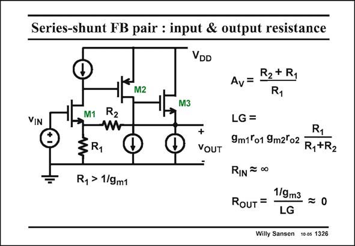

# SANSEN-1326 · Series-shunt FB pair : input & output resistance

章节：13 反馈电压放大器与跨导放大器  
PDF 页：369；书本页：376；幻灯片编号：1326  
状态：unreviewed



## 对应教材讲解

### PDF 369 · 书本 376

Now we are in a situation that we can easily calculate the loop gain. When a current source is used in the first stage, the loop gain includes the effect of the potentiometric divider with resistors R and 1 R , followed by transistor 2 M1, which is g r . m1 o1 Transistor M1 acts as an amplifier for the input signal, but as a cascode for the feedback signal. This gain is much larger, when a current source is used as a load (right). Then the gains of both transistor M1 and M2 occur in the loop gain LG. It is now much larger indeed! The input and output resistances are now easily found. Even without feedback, the input resistance is already infinity. If some Gate current is present, then the input resistance is lower, as for a bipolar transistor amplifier (see later). The output resistance without feedback is just 1/g . Indeed resistor R is usually a lot larger m3 2 and can therefore be neglected. With feedback, this resistor 1/g must be divided by the loop gain. The closed-loop output m3 resistance R is nearly zero. OUT

## 公式／性能结论候选摘录

以下为规则截取的原文，尚未逐项判读。

- PDF 369: Now we are in a situation that we can easily calculate the loop gain.
- PDF 369: When a current source is used in the first stage, the loop gain includes the effect of the potentiometric divider with resistors R and 1 R , followed by transistor 2 M1, which is g r . m1 o1 Transistor M1 acts as an amplifier for the input signal, but as a cascode for the feedback signal.
- PDF 369: This gain is much larger, when a current source is used as a load (right).
- PDF 369: Then the gains of both transistor M1 and M2 occur in the loop gain LG.
- PDF 369: Indeed resistor R is usually a lot larger m3 2 and can therefore be neglected.
- PDF 369: With feedback, this resistor 1/g must be divided by the loop gain.

## 曲线结论候选摘录

以下为规则截取的原文，尚未逐项判读。

（未由规则找到；不代表原页没有此类内容。）

## 原文条件与近似候选摘录

以下为规则截取的原文，尚未逐项判读。

- PDF 369: This gain is much larger, when a current source is used as a load (right).
- PDF 369: It is now much larger indeed!
- PDF 369: Indeed resistor R is usually a lot larger m3 2 and can therefore be neglected.

## 幻灯片 OCR（未校正）

```text
Series-shunt FB pair : input & output resistance
VDD
M2
R2 + R1
Av=
R1
VIN
M1
R2
§R1
R, > 1/9m1
M3
+
VOUT
LG =
R1
9m1°o1 9m2o2
R1+R2
RIN = 00
1/9m3
RouT =
-=0
LG
Willy Sansen 10 0s 1326
```

数学上下标、分数及正负号以原图为准。电路图已保留；未核对的连接不输出成可仿真 netlist。
