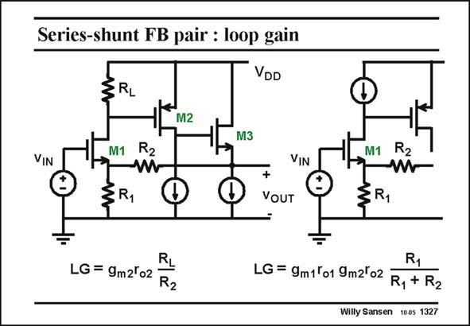

# SANSEN-1327 · Series-shunt FB pair : loop gain

章节：13 反馈电压放大器与跨导放大器  
PDF 页：369；书本页：376；幻灯片编号：1327  
状态：unreviewed



## 对应教材讲解

### PDF 369 · 书本 376

We can again easily calculate the loop gain LG. When a small load resistor R is used (left), the gain L is easily found to be the ratio of the two resistors R and L R , multiplied by the gain L of transistor M2. For a twostage amplifier, this is not high at all! The gain is again large, when a current source is used as a load (right). Then the gains of both transistors M1 and M2 occur in the loop gain LG. It is therefore much larger indeed!

## 公式／性能结论候选摘录

以下为规则截取的原文，尚未逐项判读。

- PDF 369: We can again easily calculate the loop gain LG.
- PDF 369: When a small load resistor R is used (left), the gain L is easily found to be the ratio of the two resistors R and L R , multiplied by the gain L of transistor M2.
- PDF 369: The gain is again large, when a current source is used as a load (right).
- PDF 369: Then the gains of both transistors M1 and M2 occur in the loop gain LG.
- PDF 369: It is therefore much larger indeed!

## 曲线结论候选摘录

以下为规则截取的原文，尚未逐项判读。

（未由规则找到；不代表原页没有此类内容。）

## 原文条件与近似候选摘录

以下为规则截取的原文，尚未逐项判读。

- PDF 369: It is therefore much larger indeed!

## 幻灯片 OCR（未校正）

```text
Series-shunt FB pair : loop gain
VDD
M2
M3
VIN
M1
R2
w
§R1
VIN
+
VOUT
M1
ER1
R2
LG = 9m2ºo2
R2
R1
LG = 9m1T01 9m2'02 R, + R2
Willy Sansen 1005 1327
```

数学上下标、分数及正负号以原图为准。电路图已保留；未核对的连接不输出成可仿真 netlist。
