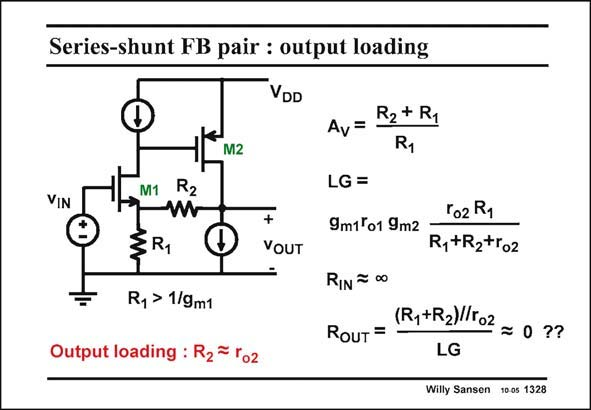

# SANSEN-1328 · Series-shunt FB pair : output loading

章节：13 反馈电压放大器与跨导放大器  
PDF 页：370；书本页：377；幻灯片编号：1328  
状态：unreviewed



## 对应教材讲解

### PDF 370 · 书本 377

An important question is,what do we need that Source follower for? After all it takes a lot of current and it only provides a voltage gain of unity! The difference is that the feedback resistor R is not 2 now any more larger than the output resistance of the output transistor. Resistor R may very well be com- 2 parable to output resistance r . As a result an additional o2 resistive divider comes in, as clearly shown by the expression of the LG. The loop gain is smaller than with a Source follower by a ratio of about (R +R +r )/(R +R ). It all depends on what the ratio is of R to r . For a small R , the loss 1 2 o2 1 2 2 o2 2 in loop gain is considerable. In this case, the output is called to be loaded. Feedback resistor R loads the output of the 2 amplifier. It forms a resistive divider with the output resistance r . As a result the LG is o2 decreased. The closed-loop output resistance R is calculated as before. The resulting value is somewhat OUT larger but still close to zero.

## 公式／性能结论候选摘录

以下为规则截取的原文，尚未逐项判读。

- PDF 370: After all it takes a lot of current and it only provides a voltage gain of unity!
- PDF 370: As a result an additional o2 resistive divider comes in, as clearly shown by the expression of the LG.
- PDF 370: The loop gain is smaller than with a Source follower by a ratio of about (R +R +r )/(R +R ).
- PDF 370: It all depends on what the ratio is of R to r .
- PDF 370: For a small R , the loss 1 2 o2 1 2 2 o2 2 in loop gain is considerable.
- PDF 370: As a result the LG is o2 decreased.

## 曲线结论候选摘录

以下为规则截取的原文，尚未逐项判读。

（未由规则找到；不代表原页没有此类内容。）

## 原文条件与近似候选摘录

以下为规则截取的原文，尚未逐项判读。

（未由规则找到；不代表原页没有此类内容。）

## 幻灯片 OCR（未校正）

```text
Series-shunt FB pair : output loading
VDD
M2
VIN
M1
R2
§R1
Ry > 1/9m1
Output loading : R2= ro2
+
VOUT
R2 + R1
Av=
LG =
ro2 R1
9m1°o1 9m2
R+R2+ro2
RIN =00
(R,+R2)/102
RouT =
= 0 ??
LG
Willy Sansen 10 0s 1328
```

数学上下标、分数及正负号以原图为准。电路图已保留；未核对的连接不输出成可仿真 netlist。
