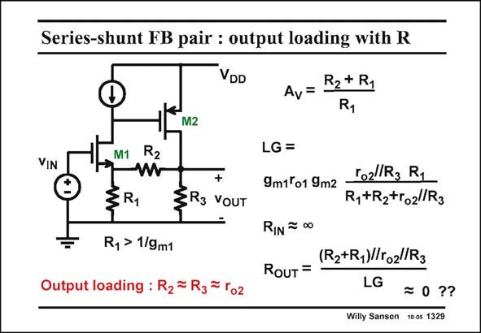

# SANSEN-1329 · Series-shunt FB pair : output loading with R

章节：13 反馈电压放大器与跨导放大器  
PDF 页：370；书本页：377；幻灯片编号：1329  
状态：unreviewed



## 对应教材讲解

### PDF 370 · 书本 377

The loop gain LG is even lower when a resistive load is used for the second amplifier M2, rather than a current source. There is an even stronger resistive division at the output than before. The result depends on the relative sizes of the feedback resistor R and resistances 2 R and r . 3 o2 The output resistance R is a little bit smaller OUT than before as no current source is used to load transistor M2 but a resistor R . 3

## 公式／性能结论候选摘录

以下为规则截取的原文，尚未逐项判读。

- PDF 370: The loop gain LG is even lower when a resistive load is used for the second amplifier M2, rather than a current source.
- PDF 370: The result depends on the relative sizes of the feedback resistor R and resistances 2 R and r . 3 o2 The output resistance R is a little bit smaller OUT than before as no current source is used to load transistor M2 but a resistor R . 3

## 曲线结论候选摘录

以下为规则截取的原文，尚未逐项判读。

（未由规则找到；不代表原页没有此类内容。）

## 原文条件与近似候选摘录

以下为规则截取的原文，尚未逐项判读。

（未由规则找到；不代表原页没有此类内容。）

## 幻灯片 OCR（未校正）

```text
Series-shunt FB pair : output loading with R
VDD
R2+ R1
Av
M2
VIN
M1
R2
§R1
+
ZR3 YoUT
Ry > 1/9m1
Output loading : R2 = R3= ro2
LG =
9m1 o1 9m2
rozlR3 R1
R,+R2+ro2/R3
RIN = 00
(R2+R1)To2/R3
RouT =
LG
=о ??
Willy Sansen 10 0s 1329
```

数学上下标、分数及正负号以原图为准。电路图已保留；未核对的连接不输出成可仿真 netlist。
