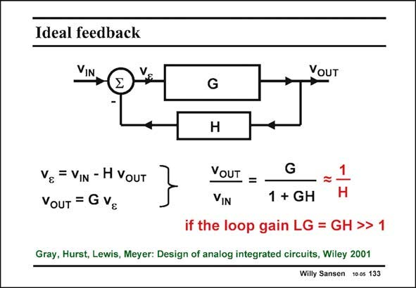

# SANSEN-133 · Ideal feedback

章节：13 反馈电压放大器与跨导放大器  
PDF 页：357；书本页：364；幻灯片编号：133  
状态：unreviewed



## 对应教材讲解

### PDF 357 · 书本 364

An ideal feedback loop consists of a unidirectional amplifier (from left to right) and a unidirectional feedback circuit (from right to left). This amplifier usually consists of a few transistors or even a full operational amplifier. As a result it provides a lot of gain. The feedback circuit usually consists of a few passive devices. They will set the closed-loop gain as shown next. Two equations describe the operation of this feedback circuit. The error voltage v is the difference between the actual e input voltage v and the feedback voltage Hv . It is amplified towards the output itself by G. in out The closed-loop gain is then easily extracted from the two equations. Its numerator is simply the gain G itself. The denominator however, is 1+GH. The quantity GH is called the loop gain LG. It is the gain, going around in the loop. Since the gain G is always quite large, the loop gain is also quite large. As a result the closed-loop gain can easily be approximated by 1/H. This is the reason why H usually consists of passive devices such as resistors or capacitors. Their ratio can be made quite accurate. As a result, the feedback amplifier has a closed-loop gain which is reasonably accurate, whereas the open-loop gain G can vary a lot depending on transistor parameters, temperature, etc. Feedback is thus the most important technique to realize amplifiers with accurate gain.

## 公式／性能结论候选摘录

以下为规则截取的原文，尚未逐项判读。

- PDF 357: As a result it provides a lot of gain.
- PDF 357: They will set the closed-loop gain as shown next.
- PDF 357: It is amplified towards the output itself by G. in out The closed-loop gain is then easily extracted from the two equations.
- PDF 357: Its numerator is simply the gain G itself.
- PDF 357: The quantity GH is called the loop gain LG.
- PDF 357: It is the gain, going around in the loop.
- PDF 357: Since the gain G is always quite large, the loop gain is also quite large.
- PDF 357: As a result the closed-loop gain can easily be approximated by 1/H.

## 曲线结论候选摘录

以下为规则截取的原文，尚未逐项判读。

（未由规则找到；不代表原页没有此类内容。）

## 原文条件与近似候选摘录

以下为规则截取的原文，尚未逐项判读。

- PDF 357: As a result the closed-loop gain can easily be approximated by 1/H.

## 幻灯片 OCR（未校正）

```text
Ideal feedback
VIN
VOUT
G
H
Ve = VIN - H VouT
VoUT = G Vg
VOUT =
G
VIN
1 + GH
if the loop gain LG = GH >>
Gray, Hurst, Lewis, Meyer: Design of analog integrated circuits, Wiley 2001
Willy Sansen 10 0s 133
```

数学上下标、分数及正负号以原图为准。电路图已保留；未核对的连接不输出成可仿真 netlist。
