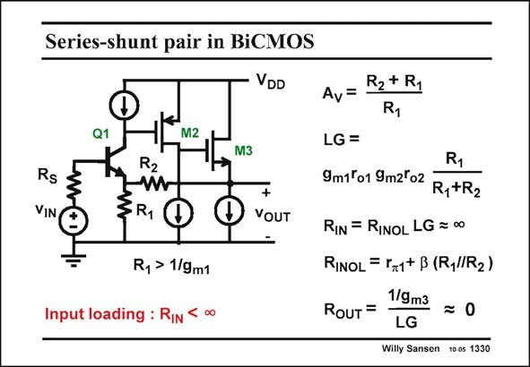

# SANSEN-1330 · Series-shunt pair in BiCMOS

章节：13 反馈电压放大器与跨导放大器  
PDF 页：371；书本页：378；幻灯片编号：1330  
状态：unreviewed



## 对应教材讲解

### PDF 371 · 书本 378

When a bipolar transistor is used at the input, then the input resistance is no longer infinity. Because of the series feedback at the input, it is increased by the loop gain LG but not infinity. This is why the input resistance loads the source resistance R . In the circuit in this slide S a source resistor R has been S added. This input loading is only present when the input voltage source has an internal source resistance R , which is comparable to S the input resistance R . IN In addition, this source resistance R forms a low-pass filter with the input S capacitance of this amplifier. The input resistance without feedback R is easily found as it INOL is a single-transistor amplifier with emitter degeneration. The emitter resistor is about R in 1 parallel with R . 2 The output resistance is quite small as calculated before. An output capacitive load would cause an output pole at fairly high frequencies.

## 公式／性能结论候选摘录

以下为规则截取的原文，尚未逐项判读。

- PDF 371: Because of the series feedback at the input, it is increased by the loop gain LG but not infinity.

## 曲线结论候选摘录

以下为规则截取的原文，尚未逐项判读。

（未由规则找到；不代表原页没有此类内容。）

## 原文条件与近似候选摘录

以下为规则截取的原文，尚未逐项判读。

（未由规则找到；不代表原页没有此类内容。）

## 幻灯片 OCR（未校正）

```text
Series-shunt pair in BiCMOS
VDD
Q1
M2
M3
Rs
VIN
R2
3R1
R, > 1/9m1
Input loading : RIN
00
+
VOUT
R2 + R1
Av=
LG=
R1
9m1°o1 9m2'o2
R,+R2
RIN = RINOL LG = ∞0
RINOL = ra1+ B (RylIR2)
1/9m3
RoUT =
= 0
LG
Willy Sansen 10 0s 1330
```

数学上下标、分数及正负号以原图为准。电路图已保留；未核对的连接不输出成可仿真 netlist。
