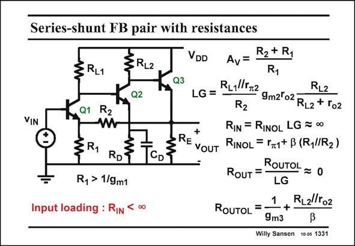

# SANSEN-1331 · Series-shunt FB pair with resistances

章节：13 反馈电压放大器与跨导放大器  
PDF 页：371；书本页：378；幻灯片编号：1331  
状态：unreviewed



## 对应教材讲解

### PDF 371 · 书本 378

A practical realization with only bipolar transistors is shown in this slide. All current sources are substituted by resistors. This circuit can also be realized easily with discrete components on a printed circuit board. Since each stage gives a higher DC voltage at the output, the second stage must be either a PNP transistor or a NPN transistor with an emitter resistor R . D To avoid the reduction in gain of this resistor, a large capacitance C is placed across it. This resistor does not come in for the gain calculations. This D is true for all frequencies higher than g /(2pC ). m2 D The expressions of the loop gain, input and output resistances are all very much as before. They are all a bit more complicated because a bipolar transistor has a finite input resistance r , p which shows up in most of the expressions.

## 公式／性能结论候选摘录

以下为规则截取的原文，尚未逐项判读。

- PDF 371: D To avoid the reduction in gain of this resistor, a large capacitance C is placed across it.
- PDF 371: This resistor does not come in for the gain calculations.
- PDF 371: This D is true for all frequencies higher than g /(2pC ). m2 D The expressions of the loop gain, input and output resistances are all very much as before.

## 曲线结论候选摘录

以下为规则截取的原文，尚未逐项判读。

（未由规则找到；不代表原页没有此类内容。）

## 原文条件与近似候选摘录

以下为规则截取的原文，尚未逐项判读。

（未由规则找到；不代表原页没有此类内容。）

## 幻灯片 OCR（未校正）

```text
Series-shunt FB pair with resistances
:RL2
RL1
Q2
Q1
R2
VIN
RD'
Ry > 1/9m1
CD
Input loading : RIN
VDD
R2 + R1
Av=
R1
Q3
R11l5.2
RL2
LG =
R2
9m2l02 RL2 + Г02
RIN = RINOL LG = 00
RE VOUT
RINOL = r1+ B (RylRz )
RouT = -
ROUTOL = 0
LG
1
RL2l/ro2
ROUTOL =
+
9m3
Willy Sansen 10 0s 1331
```

数学上下标、分数及正负号以原图为准。电路图已保留；未核对的连接不输出成可仿真 netlist。
