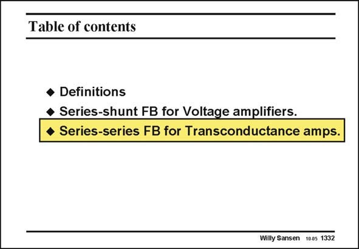

# SANSEN-1332 · Table of contents

章节：13 反馈电压放大器与跨导放大器  
PDF 页：372；书本页：379；幻灯片编号：1332  
状态：unreviewed



## 对应教材讲解

### PDF 372 · 书本 379

Let us now discuss seriesseries feedback in more detail. It is a type of amplifier which provides an accurate voltage-to-current conversion. The main difference with the voltage amplifiers is that they put out a current rather than a voltage. Both input and output resistances are high. They are evidently called transconductance amplifiers. Such high output impedance is mainly used to drive a variable impedance, for example to carry out an impedance measurement. It also provides current sources to bias any analog circuit by means of current mirrors. A single-transistor amplifier is also a transconductor. It has a high input resistance and a current output, which is fairly precise. Its transconductance is slightly low, however. An operational amplifier without output stage also behaves as a transconductor. Its transconductance is very high but not very precise. Feedback is used to obtain both, a fairly high and precise transconductance or voltage-to-current converter. Again we want to calculate the loop gain, the closed and open-loop gains, and finally the input and output resistances.

## 公式／性能结论候选摘录

以下为规则截取的原文，尚未逐项判读。

- PDF 372: Again we want to calculate the loop gain, the closed and open-loop gains, and finally the input and output resistances.

## 曲线结论候选摘录

以下为规则截取的原文，尚未逐项判读。

（未由规则找到；不代表原页没有此类内容。）

## 原文条件与近似候选摘录

以下为规则截取的原文，尚未逐项判读。

（未由规则找到；不代表原页没有此类内容。）

## 幻灯片 OCR（未校正）

```text
Table of contents
• Definitions
• Series-shunt FB for Voltage amplifiers.
• Series-series FB for Transconductance amps.
Willy Sansen 1005 1332
```

数学上下标、分数及正负号以原图为准。电路图已保留；未核对的连接不输出成可仿真 netlist。
